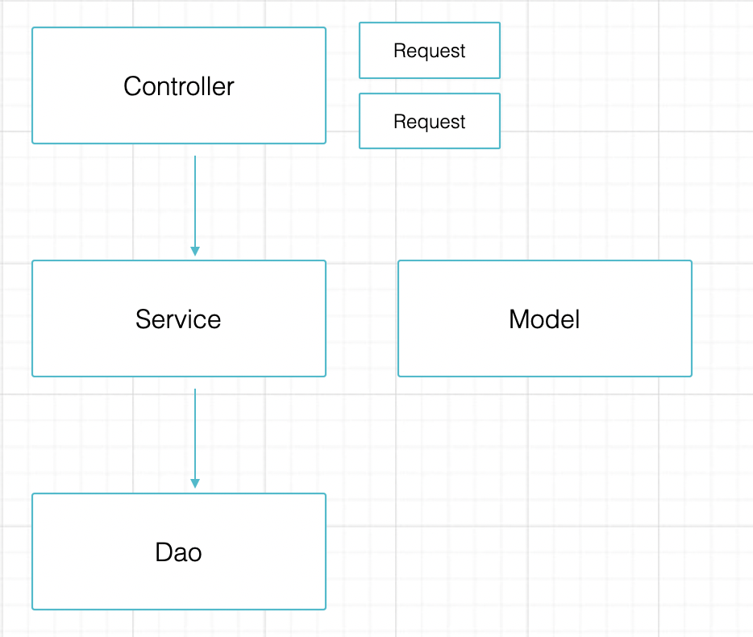
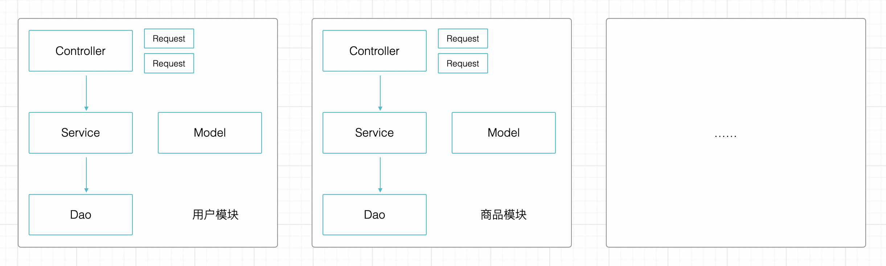
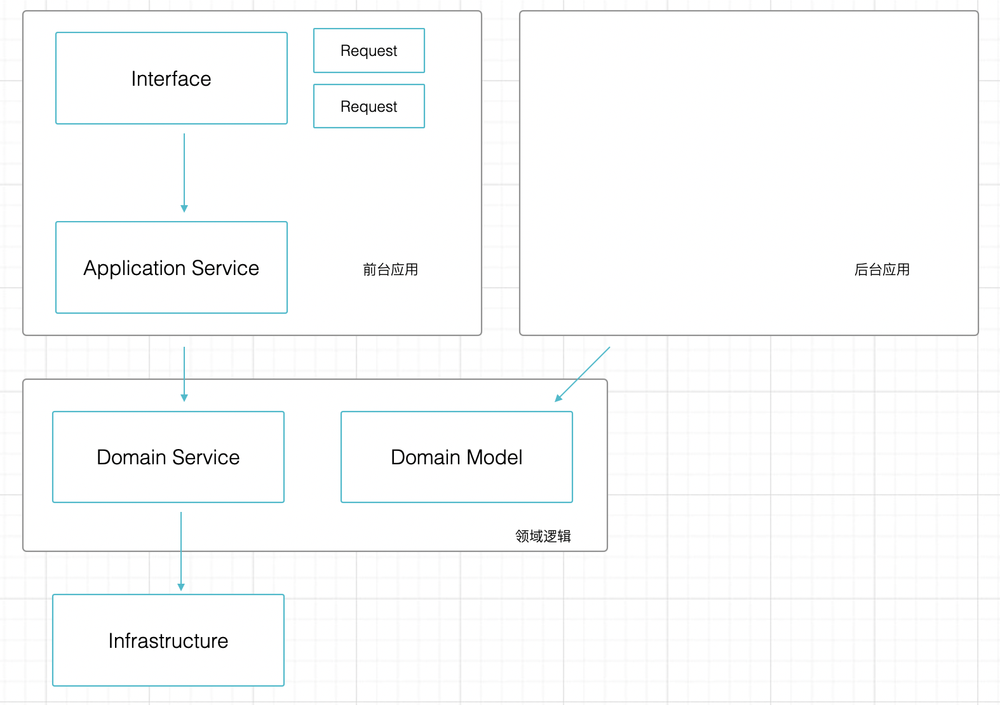
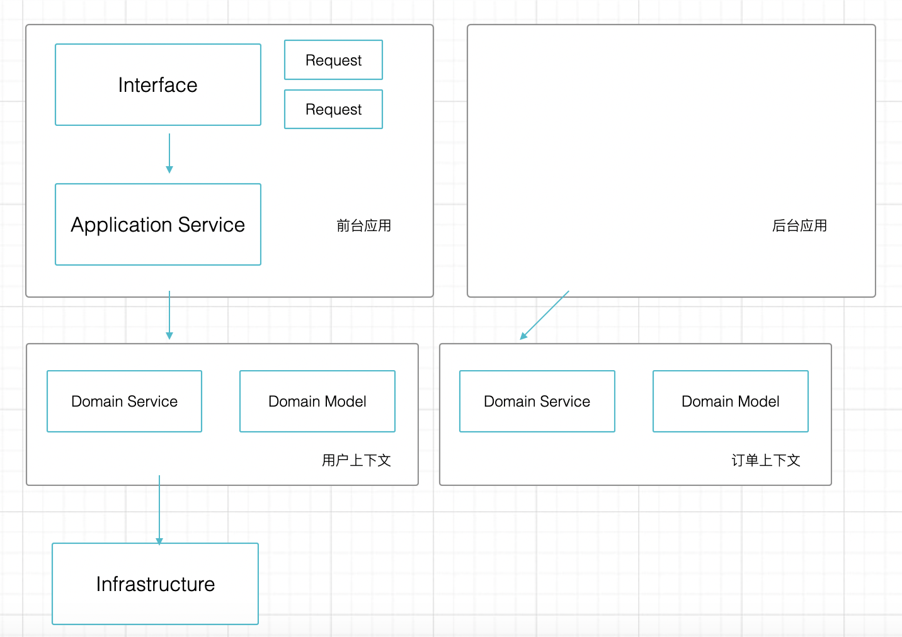
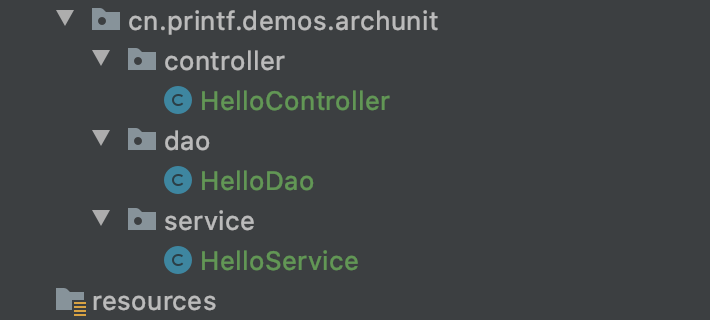
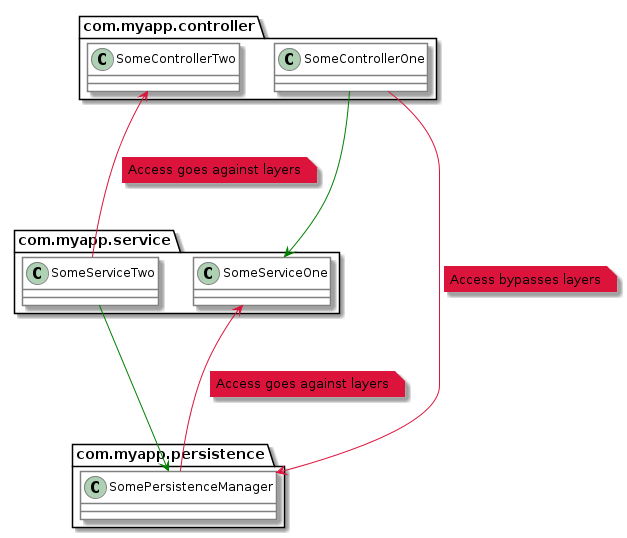

# 测试守护架构

有过大量经验的开发者都知道的一个事实是，软件项目和架构极其容易腐化。在没有很好地管控下，无论采用 MVC 三层架构还是 DDD 的四层架构，代码的结构会在几个月内变得混乱不堪。

我曾经接手过一个项目，它的依赖关系非常混乱。比如之前的开发者常常将 DTO 中的 Request 等对象用于数据库、Redis 存储，为了偷懒，明显让架构的下层依赖了上层结构。我花费了大量的时间和精力进行了重构，并在每日 Codereview 强调包结构的重要性。另外，随着不熟悉项目的新人加入，也会造成一些代码的随意放置。

实际上可以让包结构检查作为自动化测试的一部分，从而节省技术 Leader 的管理精力。[ArchUnit ](https://www.archunit.org/)是一个小型，简单，可扩展的开源Java测试库，用于验证预定义的应用程序体系结构和约束。

## 使用合适的包结构

在使用 archunit 之前，我们需要讨论下一些常见的代码分包方式。鉴于微服务和单体下组织代码的背景不同，每种微服务的分包也不同，这里按照单体系统下的结构说明。

Java 应用项目中一般有两种组织代码的方式。一种是，按照 "大平层" 的风格，即将同一类代码放到一个包中，比如 Service、Repository；还有一种是按照业务模块划分，每个模块下有自己的 “大平层”。

另外，还有两种代码分层的方式。一种是 MVC 风格的三层结构，分为 Controller、Service、Model 和 View；另外一种是 DDD 的四层结构，分为 Interface、Application、Domain、Infrastructure。

通过这两个维度会有 4 中包组织的方式，下面一一说明。

### MVC 大平层分包



这是一种最简单的分包方式，按照最开始 MVC 模式的逻辑，业务应该写在 Controller 中。但是着前后端分离的发展，View 层消失了，在 Spring Boot 等框架中 Controller  通过 Restful 的注解代替了 View 层的逻辑。

为了保持架构整洁，这种分包结构下需要有如下简单规则：

1. 相同类型的文件放到相同的包中。
2. 上层对象可以依赖下层对象，禁止反向依赖。
3. Request 对象只能在 Controller 中使用，为了保持 Service 层的复用性，不允许在 Service 中引用 Controller 层的任何类。
4. 不建议将 Model 直接作为 Response 用于接口的数据输出。
5. 所有文件需要使用包名作为结尾，例如 UserController、UserService、UserModel、UserDao。

这是一种最简单、清晰的包结构划分，这里还没有涉及枚举、远程调用、工厂、远程调用等更为细节的包结构设计，可以继续按照需要拓展，把握大方向即可。

### MVC 按照模块分包

大平层的分包在大多数项目已经够用，能做到已经非常不多，很多项目甚至没有做到这种简单的包结构维护。

但是对于一些复杂的项目，这种包结构会带来质疑。当业务很复杂时，每一个目录下的文件会非常多，因此需要根据业务进行划分模块，每个模块下，又有单独的大平层结构。



按照这种方式分包可以将各个业务模块分开，从而简化单个模块的开发复杂度，但是会让系统整体变得复杂。享受这种分包好处的同时，需要额外的注意它带来的问题。

例如用户模块的 Controller 可以访问商品模块的 Service，商品模块的 Service 又可以回过头来访问用户模块的 Dao，随着时间的流逝，虽然看起来各个模块的文件都是分开的，但是业务依然会混乱。

为了解决这个问题，使用这种分包方式，除了需要遵守上面的规则，还需要额外增加几个规则：

1. 跨模块访问时，不允许直接访问 Dao，而是访问对方的 Service。
2. 模块之间应该通过 Service 互相访问，而不是通过表关联。
3. 模块之间尽量不允许循环依赖，如果产生循环依赖，应该重新设计。

按照模块分包，对较大、复杂的应用有非常好的作用，可以将单个开发者的心智负担降低。

### DDD 大平层分包

MVC 分包的方式对大部分的情况都能很好的满足，但是对于越来越复杂的互联网应用来说，也有一定的局限性。

举个例子来说，当我们的应用需要支持多个角色的操作时， MVC 会带来一些混乱。这里的角色不是指管理员和超级管理员那种仅仅是权限不同的角色，而是管理员、用户、代理商等完全不同的操作逻辑和交互，为了避免概念上的冲突，我们把这种不同叫做 “面”。

这种思想和 DDD 的分层不谋而合。



DDD 四层结构使用了不同的概念：

1. Interface 层。用于隔离不同接口差异，比如 XML、websocket、JSON 等
2. Application 层。用于隔离应用差异，将为用户的操作和管理员的操作隔离开。
3. Domain 层。用于将复用业务逻辑。
4. Infrastructure。一些基础设施，例如数据库、Redis、远程访问。

使用 DDD 分包带来的包结构划分和 MVC 区别不算特别大，主要是将应用层分开，使用的规则比较类似。类似的，DDD 的大平层分包将应用层隔离，领域层的同类型代码放到一起。

### DDD 按照模块分包

使用 DDD 风格的分包也可以进行按照模块划分，不过它的模块划分只是针对于领域对象和领域服务，并且有一个专业的属于——上下文。



需要注意的是 DDD 的按照模块分包，并不是一股脑的将所有的 Controller、Service 纳入某个模块，这种做法会造成业务的进一步混乱。首先是将应用和领域分开，再各自按照不同的逻辑进行拆分。

DDD 风格的模块分包，也需要遵守一些额外的规则：

1. 应用依赖领域，领域不允许依赖应用。
2. 上下文之间不允许循环依赖。
3. 下下文之间的访问都需要通过 Domain Service 完成，不能直接调用对方的数据层。

### 关于分包的总结

实际工作中，以上四种分包的方式都遇到过，虽然不会完全一样，但是相差不多。选择分包的方式应该根据自己的业务情况来，如果业务简单还使用较为复杂的包结构，会带来非常多的样板代码，降低开发效率。

分层的本质是为了隔离差异，如果在已经能预知的时间内，没有差异的出现可以先不考虑的分层，这种分层除了认为增加复杂度之外往往没有用。

当然，还有洋葱架构、六边形架构等其他架构方式，但是相对比较小众，这里暂且不做分析。

## 使用 ArchUnit 

考虑好分包方式后，我们可以配置 ArchUnit 检查条件和约束规则。我们以 “MVC 大平层分包” 方式为例，说明如何使用 archunit 对包结构进行检查。当然不使用 ArchUnit 我们也可以通过团队契约、多模块的项目涉及，对团队开发做出一些约束。


### ArchUnit 的原理

ArchUnit 利用反射和字节码技术获取所有的包、类、字段等信息，并通过特定的分析来确定对象之间的访问关系。Archunit 使用 ASM 作为字节码分析的工具，但是代价是 archunit 的很多规则的定义不是类型安全的。

ArchUnit 支持的检查特性有：

1. 包依赖检查
2. 类依赖检查
3. 类和包的位置约定检查
4. 继承检查
5. 分层依赖检查
6. 循环依赖检查（Spring 支持双向依赖的锅）

ArchUnit 本身也是按照分层架构设计的，其 API 分为 三层：

1. Core：核心层，处理一些基本的类、字节码等操作，用于 import 一组类进行断言。
2. Lang：处理各种规则的语法和架构逻辑，以及一些基本的检查器。
3. Library：定义了一些更为复杂的预定义规则。

### ArchUnit 使用入门

ArchUnit 使用比较简单，可以通过 Junit 的 Runner 运行，也可以通过 Maven、Gradle 等构件工具来运行。下面的我们使用 Junit 作为示例，演示如何使用 ArchUnit。

ArchUnit 支持不同的测试框架，这里使用 Junit 4。

```xml
<dependency>
    <groupId>com.tngtech.archunit</groupId>
    <artifactId>archunit-junit4</artifactId>
    <version>0.14.1</version>
    <scope>test</scope>
</dependency>
```
我准备了一个 demo 应用，有三个包和三个主要的类，分别应用于下面的规则：

1. Controller 中的类不允许被 Service、Dao 访问
2. 所有的类名必须使用当前的包名结尾




然后在对应的测试目录下，编写一个测试类 ArchUnitTest。编写一个测试限制类名，例如所有的 Controller 文件必须以 Controller 结束。

```java
@Test
public void file_name_should_end_with_package_name() {
    JavaClasses importedClasses = new ClassFileImporter().importPackages(this.getClass().getPackage().getName());

    classes().that().resideInAPackage("..controller")
            .should().haveSimpleNameEndingWith("Controller")
            .check(importedClasses);
    classes().that().resideInAPackage("..service")
            .should().haveSimpleNameEndingWith("Service")
            .check(importedClasses);
    classes().that().resideInAPackage("..dao")
            .should().haveSimpleNameEndingWith("Dao")
            .check(importedClasses);
}
```

importedClasses 为受到影响的范围，ArchUnit 可以通过 ClassFileImporter、JavaTypeImporter 等方式加载需要被验证的类。

```
classes().that().resideInAPackage("..controller")
            .should().haveSimpleNameEndingWith("Controller")
            .check(importedClasses);
```

上面的一样代码就是一个典型的规则，使用 ArchUnit 只需要编写这些规则即可。这是一个典型的链式风格的 API。其中：

- that() 后面代表需要筛选那些符合规则的类，ArchUnit 提供了大量的筛选器，比如类型、是否使用了某种注解。
- should() 接断言规则，比如类名规则、依赖规则等。

大部分基本规则都可以使用 classes() 来声明，classes() 是 lang 层的工具方法。接下来我们来实现 MVC 分层架构的依赖检查，可以用到 libary 包中的预定义规则方法 layeredArchitecture()。

```java
@Test
public void should_obey_MVC_architecture_rule() {
    layeredArchitecture()
            .layer("Controller").definedBy("..controller..")
            .layer("Service").definedBy("..service..")
            .layer("Dao").definedBy("..dao..")

            .whereLayer("Controller").mayNotBeAccessedByAnyLayer()
            .whereLayer("Service").mayOnlyBeAccessedByLayers("Controller")
            .whereLayer("Dao").mayOnlyBeAccessedByLayers("Service");
}
```

使用 layeredArchitecture() 将 controller/service/dao 三个包中的类分别定义为 Controller/Service/Dao 层，并声明其约束关系即可。如果出现错误的依赖关系，测试就不会通过。



官网使用了一张图来说明三层架构下的依赖关系。