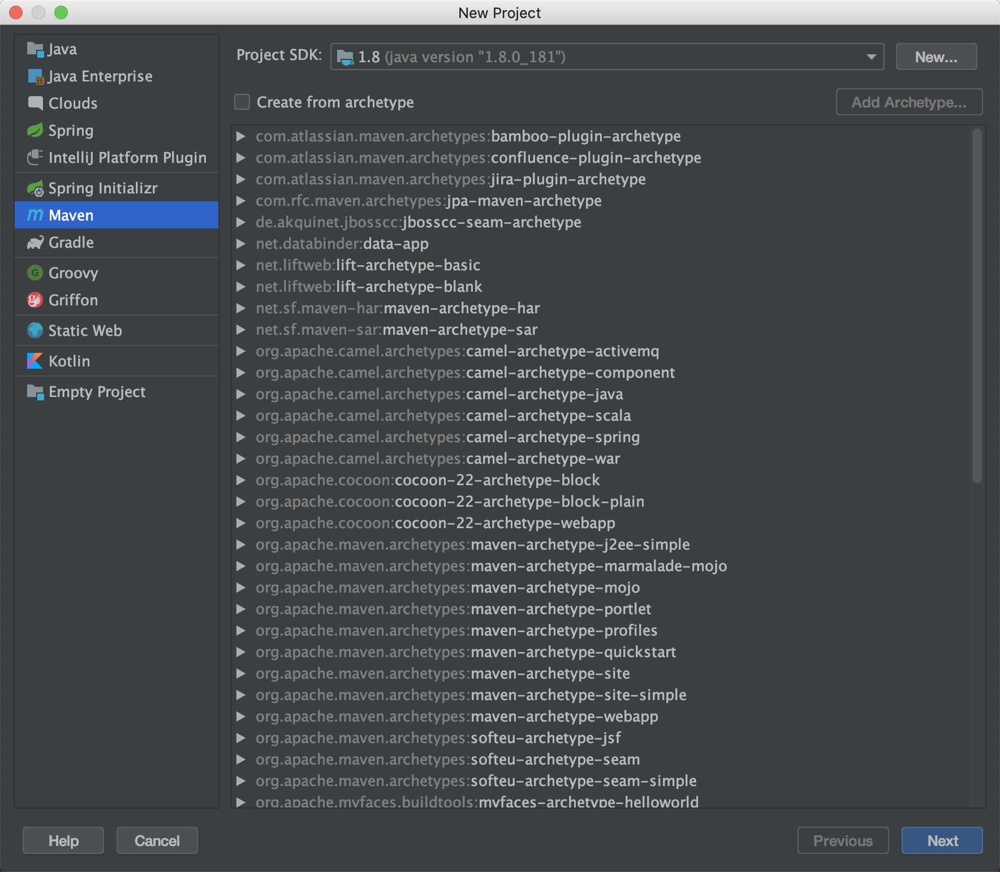

#  单元测试基础 


## 什么是单元测试?


> 在计算机编程中，单元测试（英语：Unit Testing）又称为模块测试，是针对程序模块（软件设计的最小单位）来进行正确性检验的测试工作。 ——维基百科 


什么是一个单元？


在过程化编程中，一个单元就是单个程序、函数、过程等；对于面向对象编程，最小单元就是方法，包括基类（超类）、抽象类、或者派生类（子类）中的方法。


因此“单元”是一个相对概念，因此对方法、类、模块、应用都可以被当作单元测试。简单来说，单元测试的初衷是对应用的一小部分及时的测试，而非等到所有的代码编写完成启动整个应用测试。


通常来说来说单元测试是在类、方法这个层面而言。与之相对的是集成测试、E2E 测试。


## 为什么需要写单元测试？


在没有接触单元测试之前我们是怎么做测试的？一般有两个方法：


1. 启动整个应用，像用户正常操作一样。点击界面按钮，调用一个 API 等。手动测试的坏处是每次测试都得启动整个应用，项目稍微一大非常慢，PHP、Nodejs 还好，尤其是 Java、C++ 这种编译型语言非常痛苦。


2. 在代码某个地方写一个临时入口，例如 java 的 main 方法，测试某个方法或者某个类，用完留在项目中或者删除。如果不删除的话会让项目变得很乱，删除的话下次想测试又得弄个新得。


这两个方法都有一个共同得不足，没法保留测试数据的创建过程，场景、边界的覆盖基本随缘。
单元测试本质上就是方法 2，把类似 main 方法的测试代码统一放到一个地方。然后根据一些约定，让代码更加简洁。但不强制你把测试代码放到任何一个地方。


根据约定：


- test 代码单独放到 src/test 目录下，与 src/main 一一对应
- 测试类和源代码保持同名+Test 后缀


理论上不使用任何测试框架也可以完成编写单元测试，最初的单元测试也是这样。不过好在现在可以利用 xUnit 等框架更方便的运行测试。使用框架的单元测试好处有：


- 通过 Runer 可以批量运行
- 使用 @Before 等钩子实现数据准备、数据清理
- 通过断言实现结果的验证，避免人工确定结果的正确性
- 通过覆盖率统计工具，统计代码测试覆盖率
- 通过 Mock 解决代码相互依赖的问题


当然，编写单元测试的目的除了测试方便之外，还有一个重要的用途：重构。


某些场景下，你需要改造一些遗留代码，并接近 100% 兼容原来的逻辑，没有单元测试保护的情况下，没人敢改，造成代码越来越混乱。通过单元测试对原来的业务逻辑进行覆盖，在有保护的情况开始重构，重构完成后再次运行单元测试，如果能通过测试说明基本上没有破坏性改动。


这是单元测试非常重要的一个用途。


Junit 是 Java 的单元测试套件，我们可以从最简单的单元测试开始对 Java 的一个方法进行验证，而不必启动整个应用。 


### 怎么学习单元测试？


我在接触单元测试后，对它的理念非常认可。因为当时项目处于一个 bug 丛生，开发人员永远在当救火队员的一种局面。软件的质量是每一个方法的质量决定的，大的 bug 是由细微处的小 bug 积累的。

因此我在了解了一些书和框架后，把大量实践使用到项目中，但是结果并不理想。单元测试的理念需要逐步培养，一开始就使用非常复杂的工具、库，以及 TDD 等比较高难度的实践，学习曲线陡峭，在项目中很难坚持。

因此，这里给单元测试的初学者一些简单的建议，帮助其容易的上手单元测试。


1. 学习一些简单的单元测试方法，马上到项目中应用，然后再按照需要学习其他技巧。
2. 刚开始尽量使用主流或者平台内置的框架或者库，例如 idea 可以很容易的引入 junit。选用 junit 上手是非常划算的事情，另外 junit 自带了 hamcrest 断言库，没有必要一开始就是用 assertJ 等更复杂的断言库。
3. 根据 2-8 原则，80% 的代码都是很好测试，且性价比高的，优先选择为他们编写测试。
4. 不必苛求测试覆盖率，有一些代码测试覆盖率很难提升，追求 100% 的代码覆盖率性价比非常低。


本书的编写思路也是如此。学习第一个章节《单元测试基础》后，你应该可以在项目中使用 Junit，并对一些被使用的次数多的公共方法编写测试，这些方法一般是静态方法。继续学习则可以为 Spring 的 bean 编写单元测试，最后是各种私有方法，以及需要 mock 的方法。最后才是各种高级的理念，BDD、JMH、架构测试等。


另外，单元测试的技术选型非常多，本书不打算将各个并列的技术和框架都讲到，而是选择一套最主流的技术栈。掌握了这套技术栈后，自然能拓展验证到其他技术栈。


我们会大量使用 junit 作为主线，并充分利用 junit  内置的特性帮助我们完成单元测试，当 junit 不够用时，再引入 必要的工具和库。


## 搭建环境

我们选用 Junit4 作为本教程的测试框架，除了 Junit 之外 Java 生态的测试框架还比较多，Junit4 是目前最主流也是搭建最为简单的测试框架之一。


我假定你已经有 Java 开发经验，并有 JDK、Intellij IDEA、Maven 工具，如果你使用 Eclipse、Gradle 可以先花一点时间了解Intellij IDEA、Maven 两个工具，它们都是非常简单并且容易使用的。


你可以通过 File -> New -> Project，然后选择 Maven 标签页创建一个项目。





使用 Junit 只需要在 pom.xml 文件中的 dependencies 节点添加依赖：


```xml
<dependency>
    <groupId>junit</groupId>
    <artifactId>junit</artifactId>
    <version>4.13</version>
    <scope>test</scope>
</dependency>
```


注意 scope 选择为 test，这样在打出的软件包中会自动排除 Junit 的 jar 包。如果在创建 Maven 项目的过程中遇到困难，可以参考代码示例：https://github.com/linksgo2011/java-unit-test-demos


## 给  Hello, world! 写一个单元测试

大部分人学习编写的第一个程序就是 《Hello, world!》，通过编程语言简单输出字符串 Hello, world!，代表学会了第一个程序，也标志着编程环境搭建成功。


我们编写一个类，有一个静态方法，输出一个字符串：”Hello, world!“：

```java
public class HelloWorld {
    public static String hello() {
        return "Hello, world!";
    }
}
```

静态方法是最容易测试的方法之一，一般是一些 Util 方法。工作中，我经常看到很多人，在静态方法附近编写了一个 main 函数，然后调用这个方法来测试。


```java
public static void main(String[] args){
    System.out.println(hello());
}
```


就像我们前面说的，这种方式就是一种朴素的单元测试思想。我们可以使用一个测试类和 @Test 注解代替 main 函数作为启动入口。我们创建一个 类 HelloWorldTest 添加一个 public 方法，然后添加 @Test 注解，这个时候 IDE 会自动识别这是一个可执行的测试，我们在这个方法内调用被测试的静态方法，并打印出来。


```java
public class HelloWorldTest {
    @Test
    public void should_return_world_as_string() {
        System.out.println( HelloWorld.hello());
    }
}
```


点击左侧的执行按钮，可以像 main 函数一样执行它，并得到同样的输出结果。使用单元测试会更整洁，并拥有更强的描述性。


按道理说，你的第一个单元测试便写好了。不过这个时候，你是通过肉眼每次判断程序输出是否正确，当有几十上百个测试用例运行时，难以判断你的结果是否正确。


因此我们需要在测试的代码中，定义出来什么是对的什么是错的，于是我们需要用到断言。


## 断言

计算机是一个特别讲究准确的机器，计算机程序要求务必准确。往往少了一个符号或者单词拼写错误就会让程序出现意想不到的结果，我相信多少人一个单词拼写错误就 debug 了一整天，最后发现是一个非常蠢的问题。


我是一个不是很细心的人，吃过不少这方面的苦头。初次学习 C/C++ 总是忘记输入行末的分号，直到编译时候才提示我错误，我的网名 “少个分号” 就是这样而来。


类似的，我们在编写应用程序时希望一个字符都不要错。单元测试可以帮我们检查程序的输入是否正确，并重复运行，**就需要告诉单元测试什么是对的，什么是错误的，这就是断言。**


在一些”讲究“的程序员眼里，"Hello, world!" 是神圣的，”H“ 需要大写，中间有逗号隔开，并且以感叹号结束。我们来编写第一个断言，删除 System.out.println 语句，使用 assertEquals 代替。


```java
    @Test
    public void should_return_world_as_string() {
        Assert.assertEquals("Hello,world!", HelloWorld.hello());
    }
```


assertEquals 方法的第一个参数是期望的值，第二参数是真实的值。如果这两个值相等，测试通过，控制台为绿色。如果我把方法的返回值换成了另外一个字符串：

>  “Hello，world!”   


肉眼看并没有任何问题，但是运行测试，测试会失败。原因仅仅是我把中间的逗号换成了中文的字符，中文字符和英文字符虽然看起来差不多，但是值却是不同的。单元测试没有通过，意味着成功的帮助我们保护了测试。而仅仅使用 System.out.println 是起不到这个作用的。


**断言，简单来说，目的就是为了报错，在单元测试中是非常重要的一部分。**


### 手写一个简单的断言库


我们在一些面试中，一起做编程练习。手头上有时候没有现成的断言工具，比如在浏览器上编写 JavaScript 的代码，很难快速找到一个测试框架。我们可以编写一个方法：


```javascript
function assertEquals(description, expected, actual) {
    if (expected !== actual) {
        throw new Error("ComparisonFailure, Expected:" + expected + ",Actual:" + actual);
    } else {
        console.log(description + " : %c  passs", "color:#0f0;")
    }
}
```


这就是一个最最简单的断言库，这个库只有一个方法组成。判断其他的值和实际的值是否相等，如果不相等就抛出异常，否则在控制台上打印出绿色的成功的信息。


我们根据这个简单的断言方法编写一个测试：

```javascript
function should_return_hello_world(){
    assertEquals("test hello world", "Hello", "Hello");
}
```


单元测试的逻辑实际上非常简单，我们在几分钟内就完成了一个简单的单元测试，早期一些开源软件没有特定的单元测试框架的情况下，会内置一个微小的断言库。


### junit 内置的断言方法


在真实的项目中，“相等” 这种断言方法远远不够。例如我编写了一个单例的构造器方法，在 java 中使用 == 判断的是 equals，无法起到验证这个单例的构造器是否安全，因此需要比较引用。


于是需要更多的断言方法：

- 空或者非空断言

- 引用相等断言

- 数组相等断言的

- 对象的嵌套相等断言

- 根据类型断言

  

等各种情况，你可以把这些断言逻辑写到单元测试的方法中，然后通过 assertTrue 来验证结果。assertTrue 是 junit 中的万能断言方法，传入 true 或者 false 来决定测试是否通过。。

这样并没有什么问题，但是但部分情况下断言逻辑都是重复的，单元测试写了一大堆的逻辑，这些逻辑是否需要编写新的测试来保护它们呢？因此对于断言的这部分逻辑来说，应该使用 junit 提供的断言方法，提高单元测试的有效性，也能减少样板代码。


如果我们在编写一个排序方法，可以用下面的断言对结果进行判定，assert 系列方法，可以增加一个参数描述这次断言的目的。

```java
    @Test
    public void assert_array_equals() {
        int[] input = {1, 2, 5, 7, 0};
        Arrays.sort(input);

        int[] expected = {0, 1, 2, 5, 7};
        assertArrayEquals("expected array should be sorted",expected, input);
    }
```


assertNotNull 非常实用，常用语数据库插入、枚举解析等业务。

```java
@Test
public void assert_not_null() {
    assertNotNull("should not be null", Integer.valueOf("10"));
}
```


assertSame 可以用于检查对象引用是否相同。


```java
@Test
public void should_be_same() {
    assertSame(Runtime.getRuntime(), Runtime.getRuntime());
}
```


assertArrayEquals、assertNotNull、assertSame、assertTrue 这几个方法都有相反的方法，大多数场景下这些方法都够用了。


| 断言              | 用途                  | 反向断言        |
| ----------------- | --------------------- | --------------- |
| assertEquals      | 值相等断言            | assertNotEquals |
| assertTrue        | 真值断言              | assertFalse     |
| assertNull        | 校验空                | assertNotNull   |
| assertSame        | 校验引用相同          | assertNotSame   |
| assertArrayEquals | 校验数组元素相同      | -               |
| assertThat        | 使用 Matcher 进行断言 | -               |


### 使用 assertThat 和 Matcher

上面的几种断言方法，还不能满足所有需求，比如想要验证一个返回值是否是某种类型就无法办到，除非使用 assertTrue，并配合自己的逻辑。

为了让断言更为丰富，Junit 使用了更为高明的方法，它提供一个 assertThat 方法 (实际上是 hamcrest 提供的)，第一个方法为，第二个方法接受一个函数，这个函数只用来计算条件是否满足。这个方法一般叫做 Matcher，Matcher 可以由第三方库提供。

java 中比较著名的 Matcher 库有 hamcrest 和 AssertJ，hamcrest 为 junit 内置的库，大部分情况实际上够用了。 


例如，我编写了一个 helloAndNow 方法返回 "Hello, world!" 以及当前的时间。现在没有办法使用 assertEquals，可以使用  assertThat 和 startsWith matcher 。

```java
 public static String helloAndNow() {
        return "Hello, world!" + System.currentTimeMillis();
 }

@Test
public void should_start_with_hello() {
    assertThat(helloAndNow(), startsWith("Hello"));
}
```


下面是一些常用的 matcher，其中几个逻辑 matcher 非常实用，可以大大减少测试的代码量。


| Matcher                | 示例                                                         | 用途                             |
| ---------------------- | ------------------------------------------------------------ | -------------------------------- |
| anything               | assertThat("hamcrest",anything());                           | 任何内容,一般只用来占位使用      |
| describedAs            | assertThat("hamcrest", describedAs("a description", anything())); | 用来包装一个描信息               |
| is                     | assertThat("hamcrest", is((anything()));                     | 其实没有什么用，包装一个语义信息 |
| allOf                  | assertThat("hamcrest", allOf(anything(), anything(), anything())); | 串联多个断言                     |
| anyOf                  | assertThat("hamcrest", anyOf(anything(), anything(), anything())); | 并联多个断言                     |
| not                    | assertThat("hamcrest", not(not(anything())));                | 取反断言                         |
| equalTo                | assertThat("hamcrest", equalTo("hamcrest"));                 | 测试对象 equals 相等             |
| instanceOf             | assertThat("hamcrest", instanceOf(String.class));            | 测试对象类型                     |
| notNullValue,nullValue | assertThat(null,nullValue());                                | 测试空、非空值                   |
| sameInstance           | assertThat(Runtime.getRuntime(), sameInstance(Runtime.getRuntime())); | 测试对象引用是否一致             |
| hasItems               | assertThat(Arrays.asList(1,2,3), hasItems(1, 2));            | 断言列表内容                     |

通过使用合适的 matcher 可以通过做完 asserSame 等断言方法的工作，为什么要重复造一个轮子呢？


这是因为单元测试框架和断言库做的事两件不同的事情，单元测试框架更多的是管理、运行测试，统计通过率等。matcher  一般被设计为兼容多个测试框架。如果需要考虑换测试框架，可以尽量使用 matcher 完成断言任务。

### 编写自己的 matcher

如果这些断言仍然无法满足你的需求，也可以编写一个自己的 matcher。我们断言系统生成的当前时间戳的时候，由于断言时取到系统的时间可能已经不同，无法断言出准确的值。其实只要这个时间戳在一定范围内，就可以算作通过。


我们可以编写一个简单的 matcher 完成。


```java
public class CurrentSystemTimeMatcher extends TypeSafeMatcher<Long> {
    private final long timeWindow;

    public CurrentSystemTimeMatcher(long timeWindow) {
        this.timeWindow = timeWindow;
    }

    protected boolean matchesSafely(Long time) {
        System.out.println(System.currentTimeMillis());
        if (System.currentTimeMillis() <= (time + timeWindow)) {
            return true;
        } else {
            return false;
        }
    }

    public void describeTo(Description description) {
        description.appendText(" current time not in range " + timeWindow);
    }

    /**
     * @param timeWindow tolerate the gap from System.currentTimeMillis()
     * @return
     */
    public static CurrentSystemTimeMatcher currentTimeEquals(long timeWindow) {
        return new CurrentSystemTimeMatcher(timeWindow);
    }
}
```

如果 TypeSafeMatcher 引用出现问题，可以考虑查看 CurrentSystemTimeMatcher 是否放到了源代码目录，而非 test 目录下。因为我们一般将测试的依赖 scope  设置为 test，这些类在源代码模块中无法被引用。


自定义的 matcher 使用起来和其他 matcher 一样。


```java
@Test
public void should_assert_time_with_time_window() throws InterruptedException {
    long now = System.currentTimeMillis();
    assertThat(now, currentTimeEquals(10));
}
```


### 断言并不只是单元测试的专属概念

最后，断言并不一定是单元测试中的概念。在编写真实业务代码时，也可以大量使用断言。java 1.4 中就增加了 assert 关键字，用于创建一个断言。如果断言不满足，则抛出一个异常，常常用于输入检查。


如果我们编写一个字符串连接方法，如果逐个判断输入参数是否为空，需要很多的样板代码，通过断言可以在条件不满足时丢出 AssertionError，大大减少样板代码。

```java
    public static String contactString(String first, String second) {
        assert first != null;
        assert second != null;
        return first + second;
    }
```


assert 关键字在各种框架中用的非常多，但是在业务代码中很少看到人用，超出了本书的范围，不在赘述。


###  思考题

我们知道计算机在比较浮点数字时会有精度问题，那么那个断言会通过呢？

```java
ssert.assertEquals(0.0012f, 0.0014f);
Assert.assertEquals(0.0012f, 0.0014f, 0.0002); 
Assert.assertEquals(0.0012f, 0.0014f, 0.0001);
```


这个场景在实际工作中应用非常多，例如我们需要计算价格，结果可能是一个无限小数。

```java
    public static float calculateAA(float totalPrice, float counts) {
        return totalPrice / counts;
    }
```


那么下面的断言就会通不过。

```java
   @Test
    public void should_assert_with_float_delta() {
        assertEquals(3.3333F, calculateAA(10F, 3F));
    }
```

我们需要给一个 detal 参数，表示真实值和期望值之间能容忍的差异，也就是精确的位数。

```java
@Test
public void should_assert_with_float_delta() {
    assertEquals(3.3333F, calculateAA(10F, 3F), 0.1);
}
```


想知道更多，可以查看 assertEquals 的源码，进一步了解 delta 参数。


## 测试异常

异常是日常编码中使用的非常多的特性，单元测试往往都需要覆盖异常情况，否则测试意义大打折扣。对异常断言有几种方式，@Test 注解中的 expected、assertThrows 断言工具、使用 Rule 等几种方式。


我们对示例代码做一些提高，通过一些简单的算法题，让单元测试更有趣一点。我们来做一个 leetcode 中的题目 《两数相除》，并练习单元测试。


> 给定两个整数，被除数 dividend 和除数 divisor。将两数相除，要求不使用乘法、除法和 mod 运算符。
>
> 返回被除数 dividend 除以除数 divisor 得到的商。


我用了一个最容易理解的算法，通过循环做减法。

```java
    public static int divide(int dividend, int divisor) {
        int result = 0;
        float remainder = dividend;
        while (remainder >= divisor) {
            result++;
            remainder = remainder - divisor;
        }
        return result;
    }
```

不过这个代码有一个致命的漏洞，如果传入的 divisor 为 0 就会死循环。因此我们需要增加一个异常，不允许被除数为 0，DivideByZeroException 是一个空的异常继承自 RuntimeException。


```java
        if (dividend == 0) {
            throw new DivideByZeroException();
        }
```


我们需要编写测试，验证这种行为发生，确保代码安全。


### 使用 @Test 注解中的 expected

@Test 提供了一个可选的参数 expected 可以非常简单的实现对异常的断言，这个参数只能传入 Throwable 的子类。

```java
    @Test(expected = DivideByZeroException.class)
    public void should_get_error_when_divisor_is_zero() {
        assertEquals(3, divide(9, 0));
    }
```


这是一种偷懒的方法，expected 无法断言该异常的值和消息，如果方法内部不止一个地方丢出了相同的异常，则无法准确的断言期望的异常。


因此尽量考虑其他的方式来测试异常。


### 使用 assertThrows 断言工具


Junit 最新稳定版本 4.13 支持使用 lambda 来断言异常，让断言异常保持和断言返回值相同的风格。此外，它还返回抛出的异常，以便可以进行进一步的断言（例如，验证消息和原因是否正确）。并且，可以在引发异常后对其他业务进行断言。


我们首先改造 DivideByZeroException，增加一个构造方法，以便可以传入一个消息。


```java
public class DivideByZeroException extends RuntimeException {
    public DivideByZeroException(String message) {
        super(message);
    }
}
```


给丢出异常的地方加上消息。

```java
throw new DivideByZeroException("divisor is zero");
```


接下来，使用 assertThrows 断言异常以及消息。

```java
public void should_assert_exception_type_and_message() {
    DivideByZeroException divideByZeroException = assertThrows(DivideByZeroException.class, () -> divide(9, 0));
    assertEquals("divisor is zero",divideByZeroException.getMessage());
}
```


这种断言方式更加的灵活，可以将 divideByZeroException 异常获取到，再结合使用其他的断言方法。


 ### try/catch  测试异常

如果你的 junit 版本过低，或者条件受限，一个小技巧用于测试异常就是 try/catch + fail() 方法。

```java
@Test
public void test_exception_by_try_catch() {
    try {
        divide(9, 0);
        fail("Expected DivideByZeroException be thrown");
    } catch (DivideByZeroException divideByZeroException) {
        assertThat(divideByZeroException.getMessage(), is("divisor is zero"));
    }
}
```


我们期望 divide(9, 0) 跑出异常，测试通过。如果没有抛出异常，就会走到下面的 fail 方法，告诉 junit 测试未通过。try/catch 在某些特殊场景非常有用，需要注意 fail 非常重要，否则起不到断言的作用。


### 使用 Rule 测试异常


@Rule 是一种提前声明的机制，通过声明一些期望，然后再执行业务代码，用于一些特殊的场景。

```java
@Rule
public ExpectedException thrown = ExpectedException.none();

@Test
public void test_exception_by_rule() throws IndexOutOfBoundsException {
    thrown.expect(DivideByZeroException.class);
    thrown.expectMessage("divisor is zero");
    divide(9, 0);
}
```


这个机制可以用来测试异常，不过已经被弃用，大多数情况下更推荐使用 assertThrows 来测试异常。


## 准备数据和清理数据


前面的示例使用的静态方法，但是在 java 中这种简单的场景比较少，大部分情况下需要实例化类、准备一些初始数据，以及后面会提到的 mock 方法。


因此 junit 给我们提供了几个非常有用的注解，用于准备、清理有状态的数据。下面示例编写了一个简单的字符串拼装器，然后通过 @Before 注解来为每次的测试准备数据。


```java
class StringAppender {
    private String value = "";

    public void append(String appendText) {
        value = value + appendText;
    }

    public String getValue() {
        return value;
    }
}
```


```java
StringAppender stringAppender;

@Before
public void setup() {
    stringAppender = new StringAppender();
}

@Test
public void should_get_text_from_object() {
    stringAppender.append("Hello");
    stringAppender.append(",world");
    assertEquals("Hello,world", stringAppender.getValue());
}
```


Junit 4 中有四个执行过程注解：


- @BeforeClass 用于类加载首次执行，必须使用在静态方法上
- @Before 用于实例方法，在每个测试用例之前执行
- @After 用于实例方法，在每个测试用例之间执行
- @AfterClass 用于类完成执行，必须使用在静态方法上


在 @Before 和 @After 方法之间，执行每一个测试用例。他们的执行顺序是：


> @BeforeClass -> @Before -> @After -> @Test -> @AfterClass


如果有父类的方法出现 @Before、@BeforeClass 等方法，父类会优先执行。例外场景是使用了 @Overide 对方法进行了覆盖。

执行下面的测试，查看结果。

```java
@BeforeClass
public static void beforeClass() {
    System.out.println("@BeforeClass");
}

@Before
public void setup() {
    System.out.println("@Before");
}

@After
public void tearDown() {
    System.out.println("@After");
}

@AfterClass
public static void afterClass() throws Exception {
    System.out.println("@AfterClass");
}
```

```text
@BeforeClass
@Before
@After
@AfterClass
```


## 单元测试用例设计

junit 本身比较简单，到目前为止，junit 内置的特性，足够编写大部分依赖简单的测试代码了。接下来聊一聊怎么设计测试用例。


**测试用例 (Test Case) 是指软件某项特性的测试任务的描述，一般指某一个特性的规格。**单元测试的对象一般是方法、组件，也就是说是对 “轮子” 的质量进行验证。它的测试用例应该略有不同，更准确的说应该是特性被一次访问的描述。


Junit 中 @Test 修饰的方法就代表了一个测试用例，除了准备数据之外，一个测试用例只对组件的一个特性进行验证，这个验证可能包括多次断言，确保正确。


一个必要的用例需要由下列几个元素组成：

- 输入数据 (given)，有时候是空
- 和被测试的方法交互（when）
- 断言（then）


可选的元素：

- 数据准备 
- 数据清理


接下来就来设计一个用例。


### 等价划分和边界分析


回文数是指正序（从左向右）和倒序（从右向左）读都是一样的整数，回文字符串很好判断，但是回文数是实现呢？我写了一个实现，然后设计用例来保证它的可靠性。


```java
    public static boolean isPalindrome(int inputValue) {
        if (inputValue < 0) {
            return false;
        }
        int reverseValue = 0;
        int intermediateValue = inputValue;
        while (intermediateValue != 0) {
            reverseValue = reverseValue * 10 + intermediateValue % 10;
            intermediateValue /= 10;
        }
        return reverseValue == inputValue;
    }
```


我们先设计一个最简单的测试，输入一个普通的值，比如 8。下面这个测试会通过，因为单个数字都满足条件。这样的简单通过的测试，一般叫做 “happy pass”，大家都比较开心。

```java
@Test
public void should_be_true_if_value_is_eight() {
    // given
    int inputValue = 8;
    // when
    boolean palindrome = isPalindrome(inputValue);
    // then
    assertTrue(palindrome);
}
```


如果这个方法被很多人使用，会遇到各种各样的场景。


- 如果这个值是负数结果是什么呢？
- 如果这个值是 0 结果是什么呢？
- 如果这个值是 7  结果是什么呢？
- 如果这个值是一个两位数结果是什么呢？
- 如果这个值是 Java int 类型最大值结果是什么呢？
- 如果这个值是 java int 类型的最小值结果是什么呢？


幸好我们在使用类型系统完善的 java，如果使用弱类型语言，例如 JavaScript 那么问题会更多。


因此设计用例的时候，最基础的方法就是：边界值分析和等价类划分。想象这个数字在一个数轴上：

- 最小值到 0 是两个边界
- 0 到 10 是一个边界
- 10 到最大值是一个边界


边界上的输入作为一个测试用例，例如 0、10。边界中间的一些数据，例如 7,8 可以看做等价的，取一个即可。

我们使用表格进行描述：


| 边界值            | 用例输入          | 期望结果 |
| ----------------- | ----------------- | -------- |
| Integer.MIN_VALUE | Integer.MIN_VALUE | False    |
| 0                 | 0                 | True     |
| 5                 | 5                 | True     |
| 10                | 10                | False    |
| 11                | 11                | True     |
| Integer.MAX_VALUE | Integer.MAX_VALUE | False    |


上面表格一共 6 个用例，能比较充足的考虑到各种情况。写完 6 个用例需要占用大量篇幅，就不再给出示例。实际工作中，遇到这种有固定输入模式的用例，可以想办法减少样板代码，我们在后面 junit 另外一个特性中介绍。


### 根据可达路径设计用例


另外一种更常用的用例设计方法是可达路径，可达路径是指根据代码中分支语句的数量，程序具有不同的数据流动路径。单元测试应该保证，每条路径都能达到。


我用简化版的 Fizz Buzz  问题说明，Fizz Buzz 是一个常见的编程练习题，主要考察代码设计。


> 给你一个整数 n。如果这个数被3整除，返回 fizz。如果这个数被5整除，返回 buzz。如果这个数能同时被3和5整除，返回 fizz buzz。如果都不满足，返回 null。


这里是一个最简单的实现：


```java
public static String simpleFizzBuzz(int n) {
    if (n % 3 == 0 && n % 5 == 0) {
        return "fizz buzz";
    } else if (n % 3 == 0) {
        return "fizz";
    } else if (n % 5 == 0) {
        return "buzz";
    }
    return null;
}
```


simpleFizzBuzz 方法的路径有 4 条，分别是满足各个条件返回单词，不满足则返回 null。


| 路径                     | 用例输入 | 期望结果  |
| ------------------------ | -------- | --------- |
| n % 3 == 0 && n % 5 == 0 | 15       | fizz buzz |
| n % 3 == 0               | 3        | fizz      |
| n % 5 == 0               | 5        | buzz      |
| 其他                     | 10       | Null      |


一个方法可达路径的数量还可以衡量一段代码的复杂度，如果可达数量非常多，说明了这个方法非常复杂，需要相应的增加用例数量保证它的可靠性。这种复杂度被叫做圈复杂度。


如果一个方法非常大，圈复杂度则相对高，随着各种条件语句的组合，复杂度会呈指数上升。圈复杂度一般在 20 内为比较合适，超出 40，测试的代价非常高昂。这也是为什么单元测试的成本要远远低于，集成测试和 UI 测试。


测试用例设计总结下来就是一句话，但是这句话做到很难：**彼此独立，完全穷尽。** 也就是逻辑学上的正交性，我们在思考很多生活中的问题其实也是这样。安排一场活动、设计一个方案皆是如此。


## 参数化用例

如果按照前面的用例设计方法，往往设计出的用例会非常多。按照回文数的表为例，我们共有 6 中输入数据。每一个行对应一个单元测试，会非常冗长。


我们可以使用 Parameterized 的风格输入一组二位数组。


```java
@RunWith(Parameterized.class)
public class ParameterizedPractiseTest {
    @Parameterized.Parameters
    public static Collection<Object[]> data() {
        return Arrays.asList(new Object[][]{
                {Integer.MIN_VALUE, false},
                {0, true},
                {5, true},
                {10, false},
                {11, true},
                {Integer.MAX_VALUE, false}
        });
    }

    private int input;

    private boolean expected;

    public ParameterizedPractiseTest(int input, boolean expected) {
        this.input = input;
        this.expected = expected;
    }

    @Test
    public void test() {
        assertEquals(expected, isPalindrome(input));
    }
}
```


实际上这只是一种语法糖，通过 @Runwith 注解输入了 Parameterized Runner 帮助生成了6 个独立的测试。

@Parameterized.Parameters 定义了 6 条数据作为输入输出。这个注解允许传入一个模板，给6个独立的测试输出一个名称，便于识别。


```java
@Parameterized.Parameters(name = "{index}_input_({0})_should_be_{1}")
```


我们在控制台就可以看到 6 个独立的测试。


Runner 是 junit 比较高级的技术。另外一个第三方 JUnitParamsRunner，可以运行直接将 Parameters 注解组合应用于测试方法上，显得更为简洁。

JUnitParamsRunner 需要自行通过 maven 导入。

```java
@RunWith(JUnitParamsRunner.class)
public class PersonTest {

  @Test
  @Parameters({"17, false", 
               "22, true" })
  public void person_is_adult(int age, boolean valid) throws Exception {
    assertThat(new Person(age).isAdult(), is(valid));
  }
 
}
```

  

## 测试覆盖率


如果我们的用例设计的不好，或者不够多，必然很多分支和情况没有考虑到。我们可以通过统计测试覆盖率和覆盖情况检查我们用例设计，从而改善用例设计。

使用 IDE 内置的测试覆盖率统计统计，即可满足我们大部分需求。只需要使用 Run xx with Coverage 即可。Intellij Idea 不仅可以针对类统计覆盖率，还可以选中一个包统计单元测试覆盖率。


运行完测试覆盖率后，IDE 会弹出一个统计窗口，同时代码编辑器会显示出那些代码被覆盖。


覆盖率分为，类、方法、分支覆盖率、行覆盖率，一般项目会要求将类、方法覆盖率达到 100%，行和分支覆盖率到 80%。其实主要指标覆盖率应该看分支覆盖率，通过分支覆盖率进一步完善我们的测试用例。


在工程化方面，我们可以使用 surefire 和 jcoco 来运行测试并获取测试覆盖率，同时上传 report，这个在工程化部分说明。


## Junit Rule  使用


Junit Rule 提供了一种类似拦截器的机制，用于拓展 junit 的各种行为，给每个测试添加一些通用的行为。常见的用途有全局设置超时时间、获取当前的测试名称、打印日志等。


官方网站上给的一些例子不是很常用，例如 TemporaryFolder 这个 rule 提供了一个文件的模拟机制，但是更好的做法是使用 mock 工具。还有一个例子就是前面提到过的通过 rule 来完成的异常测试，后面也会讲到一个通过 rule 实现超时的技巧。


我们来看一个最简单使用 rule 的例子，TestName 会被每个测试在运行期执行，并将当前的信息传递给 rule，通过这种方式获得测试名称。


```java
public class NameRuleTest {
  @Rule
  public final TestName name = new TestName();
  
  @Test
  public void testA() {
    assertEquals("testA", name.getMethodName());
  }
  
  @Test
  public void testB() {
    assertEquals("testB", name.getMethodName());
  }
}
```


一般我们用到 rule 的地方不多，但是需要知道这种机制的存在，便于在需要的时候实现一些全局的逻辑，提高效率。

例如，我们可以给每个测试生成一个专用的日志对象，用于记录测试过程中的信息。


```java
public class TestLogger implements TestRule {
  private Logger logger;

  public Logger getLogger() {
    return this.logger;
  }

  @Override
  public Statement apply(final Statement base, final Description description) {
    return new Statement() {
      @Override
      public void evaluate() throws Throwable {
        logger = Logger.getLogger(description.getTestClass().getName() + '.' + description.getDisplayName());
        base.evaluate();
      }
    };
  }
}
```


## 其他技巧


### 忽略测试 

如果因为某些原因（可能是快速修复 CI，避免影响队友工作），你需要快速忽略测试。尽量不要使用大面积注释代码的方法，请使用 @Ignore 注解，并加上原因，并随后修复。


和删除/注释代码相比， @Ignore  会被测试框架统计进去，显示为已经忽略的测试数量。


```java
@Ignore("Test is ignored as a demonstration")
@Test
public void assert_same() {
    assertThat(1, is(1));
}
```


### 测试超时

如果一个测试运行时间很长，往往意味着测试失败。junit 提供了一种方式结束它，使用 @Test 注解的 timeout 参数可以传入一个毫秒数。


如果这个测试的运行时间，超过了 timeout 允许的时间，junit 会中断测试线程，标记测试失败，并丢出异常。需要注意的是，junit 启动了另外一个线程并发出中断信号，如果测试代码无法被中断。


```java
	@Test（timeout = 1000）
  public  void test_with_timeout（）{
   	... 
  }
```


timeout 参数只是针对单个测试的超时时间，如果想要一次性对所有的测试都应用这个规则，可以使用 rule。

```java
public class GlobalTimeoutPractiseTest {
    @Rule
    public Timeout globalTimeout = Timeout.seconds(10);

    @Test
    public void test_sleep_11_seconds() throws Exception {
        Thread.sleep(11000);
    }

    @Test
    public void test_sleep_12_seconds() throws Exception {
        Thread.sleep(12000);
    }
}
```


Timeout Rule 定义了一个全局的 Rule，在当前的类下奇效。同时会计算上 @Before、@After 方法的时间。但是如果，被中断的方法是因为死循环造成的，Junit 会直接停掉，@After 方法可能不会被执行。


### 聚合测试套件


有时候需要将一组测试用例一起作为一个测试套件运行。可以使用 Suite 作为 Runner 实现，通过 @Suite.SuiteClasses  传入需要组合的测试类即可实现单元测试套件。


```java
@RunWith(Suite.class)
@Suite.SuiteClasses({
        HelloWorldTest.class,
        AssertPractiseTest.class
})
public class SuitesPractiseTest {
    
}
```


## 新手容易犯的错误


### No tests found  找不到单元测试


遇到这种情况有可能是以下原因。


1. 单元测试的方法被设置为了 private ,修改为 public 即可。junit5 不会存在这个问题。
2. classpath 中存在多个版本的 junit 包。


### initialization error 初始化失败


这种情况可能是把 @Test 注解注释了，IDEA 存在问题识别了是一个测试，但是启动器没有识别。另外遇到这类问题，也可以检查下 @Test 的注解引入的包路径是否正确。是否为 Junit 包下面的注解。


### IDEA 不出现执行按钮


Junit 没有被 IDEA 识别，检查右侧的 Maven 是否拉取了正确的依赖。尝试重新加载 maven 依赖，然后重启 Idea。


### 明明加载 Junit 的依赖，但是 @Test 还是爆红


如果你的依赖是使用 test 的 scope 加载，但是把测试类创建到了源代码目录，Junit 的相关类和注解是无法使用的。

继续保持 scope 为 test，并把测试类移动到 test 模块下。


## Java 单元测试约定和原则


很多网友和同事曾问我，怎么做单元测试才算一个比较好的测试。对于团队开发来说，只要是有效的、容易维护的测试就是好测试。因此单元测试不比业务代码，尽量轻量级，然后坚持做下去。

为了让团队对单元测试有一个统一的认识和理解，我选择 FIRST 原则（FIRST 和 AIR 原则，为单元测试的两种描述方式），并整理了一些约定。


### FIRST 原则和解释

**F-FAST(快速原则)**

单元测试应该是可以快速运行的，单元测试作为非常细粒度的测试，需要能快速跑完一个用例，如果不能，可能是粒度过大。

**I-Independent(独立原则)**

单元测试的每个用例应该是独立的，用例之间不相互干扰和依赖，并与顺序无关。可以通过 setup 和 teardown 方法来保证。另外，也不应强依赖外部环境，尽量和环境隔离。

**R-Repeatable(可重复原则)**

单元测试的每个用例可以被重复运行，并得到同样的结果。另外，能在不同的环境上运行，例如团队成员其他的开发设备。

**S-Self Validating(自我验证原则)**

单元测试的每个用例运行结果通过断言验证，不应通过人工验证。

**T-Timely(及时原则）**

单元测试保持和源代码同步更新，修改源代码时，应该先修改单元测试为期望的结果，再对源代码作出修改，保证重构安全。


### 单元测试约定


1. 测试用例的方法名称使用下划线，并表达出一个完整的句子，单元测试可以作为”活“文档。

2. 测试文件的创建和业务代码类一一对应，并放置到和业务代码同级的测试模块中，例如 ”src/test/java“。IDE 工具可以自动识别，并通过快捷键跳转。

3. 测试文件和业务代码文件同名，并使用 Test 结束。

4. 按照 given/when/then 的风格组织测试代码

5. 测试用例必须有充分的断言语句

6. 单元测试不需要特别的设置就能运行

7. 不允许注释单元测试方法，如果需要快速跳过，使用 @Ignore 注解

8. 如果对全局对象造成改变，使用 @After 注解的方法清理，保持独立原则

9. 如果被测试的类实现了接口，尽量通过接口的类型测试

10. 配置合适的测试覆盖率，核心代码测试率为 100%。为不同的代码配置不同等级的测试覆盖率。

11. 通用的准备工作，使用 @Setup 准备

12. 通用的数据准备工作，可以通过抽出测试助手类完成

13. 提交代码前保证单元测试通过

14. 修改业务代码，同步修改单元测试，并补充足够的用例

    

## 小结


单元测试并不是高级工程师的专利，而应该是合格工程师的基本能力。单元测试工具、框架的选用，以轻量级、能坚持为原则。一上来就是 100% 的单元测试覆盖率，或者使用一些冷门复杂的框架不利于坚持下去。

本章介绍了单元测试的基础部分，介绍了如何使用断言、测试异常，然后介绍了数据准备和清理的方法，最后提供了一些技巧和错误的方法。任何团队编码工作都需要一些契约，保证团队协作顺利。因此，在最后整理了一份单元测试的约定和原则。

到此的知识内容，已经能满足大部分类库的单元测试编写。应用程序的代码往往耦合更高，对于这类单元测试的编写则还需要一些其他的技巧，将在后面的内容介绍 。