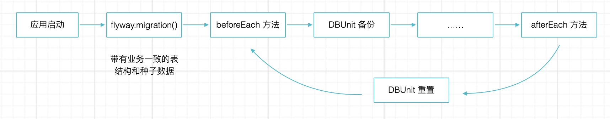
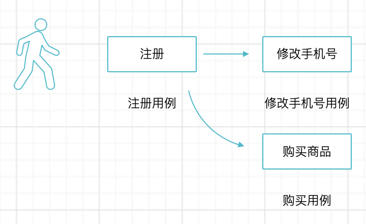

# 准备测试数据

在我过去参与的项目中，准备测试数据的方法各种各样。在给一些大型企业做咨询时，建议他们的开发团队使用单元测试或者 API 测试来守护代码。他们在编写测试的过程中遇到的第一个困难就是测试数据的准备。

测试数据的准备往往会遇到几个问题：

- 测试数据库表结构的更新和一致性，怎么和业务数据库保持同步？
- 测试间数据怎么隔离？
- 通过什么方式准备数据？

这几个问题都没有唯一答案，下面就聊一下我在项目中采用过的方案，以及推荐比较好的方式。

## 数据 DDL 更新

如果是第一次编写单元测试我们可以将业务数据库中的数据库结构导出，放置到测试资源目录下，测试启动时通过 JdbcTemplate 执行即可。很多团队刚开始编写测试的时候是这么做的。

但是慢慢会发现一个问题，业务数据的不断更新也需要手动更新这个启动脚本。随着时间的推移，人的约定总之是不可靠的，后面差异会慢慢变大，则需要在测试上 debug 的时间变长，让编写测试得不偿失。

在业务开发过程中，我们可以使用 flyway 作为数据迁移工具，在测试中，我们可以复用业务代码中的 flyway 迁移脚本。Spring Boot 默认启动就会进行数据库迁移。如果使用的 @SpringBooTest 则完全可以不用关心，如果使用的 @SpringTest 则需要手动的引入 Flyway 并进行 migration 操作。

```java
    @Autowired
    Flyway flyway;

    @BeforeEach
    public void setUp() {
      flyway.migration()
    }
```

## 测试间数据隔离

每个测试需要准备数据，应用执行业务逻辑之后，又需要重置数据防止对下一次测试干扰。因此需要做到测试间的数据保持隔离，测试间数据隔离通常有三种方法：

1. 应用启动时候初始化数据库结构和种子数据，每次测试都准备数据，测试完成后清理掉，下一次测试并重新插入数据。这种做法的麻烦之处在于初始化脚本的种子数据需要剥出来，不然清掉了不知道如何重置出来，否则又需要维护重复的脚本。
2. 应用启动时候初始化数据库结构，插入必要的数据，利用 Spring Test 提供的测试事务工具回滚掉数据库操作。这种方法对 Service 的测试有效，但是对 API 级别的测试不可行。
3. 应用启动时候初始化数据库结构和种子数据，通过一些测试库，例如 DBUnit “记忆” 当前的数据库状态，每个测试执行完成后恢复到当前的状态（包含数据库结构和全局基本的测试数据）。

在实际项目中，往往需要编写大量的 API 测试，方法 2 不太可行。方法 1 需要很多手动的工作，使用初始化数据库的时候往往也有一些种子数据，如果直接全部清理掉全部的数据，这部分数据也要手动加回来。因此往往使用方法 3，虽然不一定使用 DBUnit。

使用 DBUnit 可以在一定程度上减少测试的数据准备工作，下面简单介绍一下 DBUnit 和使用方法。

DBUnit 的逻辑非常简单，就是在测试前备份数据库（Flyway migration 后包括数据库结构和一些基本的种子数据），然后提供接口让我准备需要的测试数据。测试完毕后，读取这些备份文件恢复到之前的状态，为下一次测试做准备。



虽然 DBUnit 的特性比较多，实际上我们一般需要功能也就这么多，自己实现这样的逻辑也非常简单，使用 DBunit 的话只需要简单的配置即可。

基于 DbUnit 定义了一个类型 IDataSet。IDataSet 代表一个或多个表的数据。
有下面几种实现：

- FlatXmlDataSet：数据表的 XML形式
- XlsDataSet ：数据的excel表示

首先引入 DBUnit 的依赖。

```xml
    <dependency>
        <groupId>org.dbunit</groupId>
        <artifactId>dbunit</artifactId>
        <version>2.5.3</version>
    </dependency>
```

我编写了一个 DbUnitFixture，提供了backupDatabase()、resumeDatabase() 两个方法，利用 DBUnit 将数据库被分到一个 XML 文件中，只需要在所有测试的基类中使用即可。

```java
@Service
public class DbUnitFixture {

    private static IDatabaseConnection conn;
    @Autowired
    private DataSource dataSource;
    private File tempFile;

    public void backupDatabase() throws Exception {
        conn = new DatabaseConnection(DataSourceUtils.getConnection(dataSource));
        Connection connection = dataSource.getConnection();
        DatabaseMetaData metaData = connection.getMetaData();
        ResultSet tables = metaData.getTables(null, null, null, new String[]{"TABLE"});
        ArrayList<String> tableNames = new ArrayList<>();
        while (tables.next()) {
            String tableName = tables.getString("TABLE_NAME");
            tableNames.add(tableName);
        }
        connection.close();
        QueryDataSet qds = new QueryDataSet(conn);
        for (String str : tableNames) {
            qds.addTable(str);
        }
        tempFile = new File("build/resources/test/" + "temp.xml");
        FlatXmlDataSet.write(qds, new FileWriter(tempFile), "UTF-8");
    }

    public void resumeDatabase() throws Exception {
        FlatXmlDataSetBuilder builder = new FlatXmlDataSetBuilder();
        builder.setColumnSensing(true);
        IDataSet ds = builder.build(new FileInputStream(tempFile));

        DatabaseOperation.CLEAN_INSERT.execute(conn, ds);
        this.closeConnection();
    }

    protected void closeConnection() throws SQLException {
        if (conn != null) {
            conn.close();
        }
    }
}
```

在测试的基类中使用。

```java
@Autowired
DbUnitFixture dbUnitFixture;

@BeforeEach
public void setUp() {
    dbUnitFixture.backupDatabase();
}

@AfterEach
public void setUp() {
    dbUnitFixture.resumeDatabase();
}
```

这个类必须在 Spring 的测试环境使用，如果想在纯净的 Junit 环境中使用，不要从 Spring 容器中获取 Connection，改为手动创建即可：

```java
    Class.forName("com.mysql.jdbc.Driver");
    Connection dbConn=DriverManager.getConnection("jdbc:mysql://localhost:3306/test", "root", "root");
    conn =new MySqlConnection(dbConn,"test");
```

## 准备数据

通过什么方法给测试准备数据呢？我见过的方法有好几种。

1. 直接往数据库中插入数据。这种方法最简单粗暴，麻烦在于这种方式需要准备的 SQL 比较多，并且往往也类型不安全，工作非常繁琐。
2. 使用 Rest 调用 API 执行特定的业务逻辑准备数据，这种方法保证的业务逻辑的完整性和可靠性。但是缺点也很明显，就是慢。编写测试慢、开发慢、跑起来也慢。
3. 调用 Service 执行业务逻辑，并结合一些通用的测试夹具来准备测试。折中下来，这种方式成本稍低，效果也还行。我目前使用这种方式。

实际工作中，我使用一种被叫做 User Journey 的测试策略。

这个策略很简单：

1. 从简单的业务开始编写测试，保证前置的业务逻辑完成。
2. 使用完成测试的前置方法给后面的方法准备数据，并信任前置方法。



在制造测试数据的时候有一个技巧——利用构造者方法的链式调用来处理通用数据和某个用例的自定义数据的问题。

比如，大部分情况下，预制一个默认用户的数据是一样的。就可以编写一个通用的方法。 

```java
userService.create(new User("username","password","13550982919"));
```

但是当我测试用户的密码规则时，这就不够用了，我需要构造出不同密码的用户来。当然我们可以使用参数，然后通过 if 来给予默认值。这样显得非常麻烦。通过引入 lombok 给 User 增加一个 Builder 能力，处理这种场景就从容得多了。

定义一个 User 类。

```java
@Getter
@Setter
@ToString
@Builder
@NoArgsConstructor
@AllArgsConstructor
public class User {
    private String username;
    private String password;
    private String phone;
 }
```

在某个测试助手的类中，编写 Builder 的方法。

```java 
public static User.UserBuilder userCreateStart(){
    return User.builder()
            .password("1311234123")
            .phone("13112341234")
            .username("test");
}
```

创建通用的用户时。

```java
userService.create(userCreateStart().build());
```

如果需要覆盖某些字段只需要增加相应的方法即可。

```java 
createUser(userCreateStart().password("1234567").build()).getId();
createUser(userCreateStart().password("a12345678").build()).getId();
```

这是一个非常初级的构造者模式的应用，但是在编写测试的过程中非常有用。