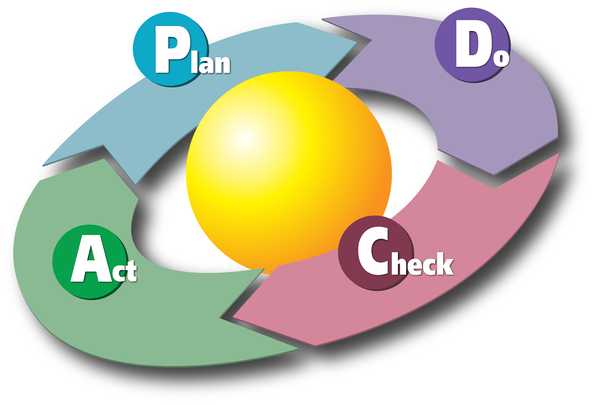
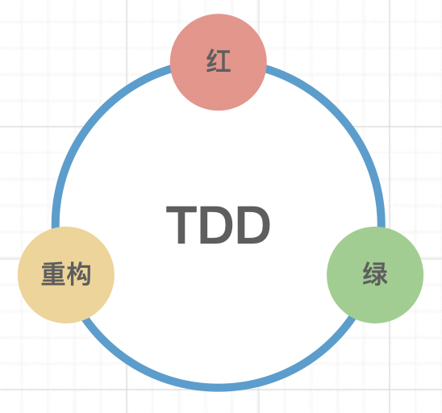
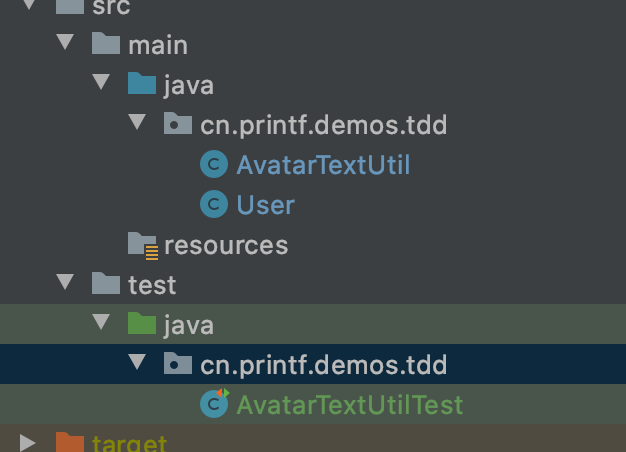
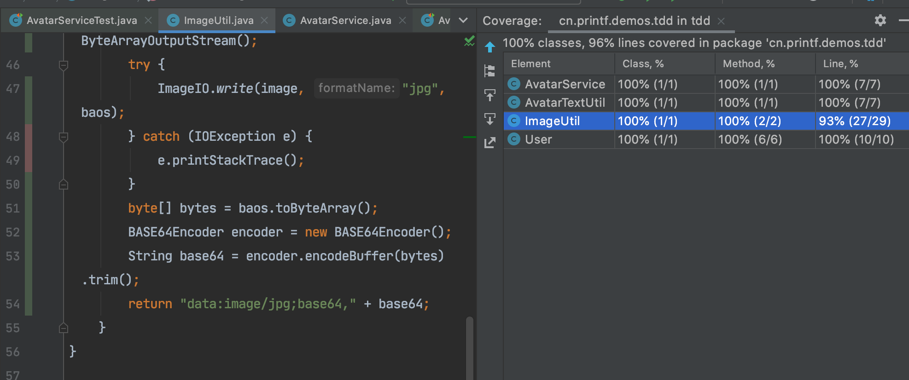
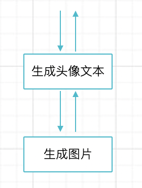
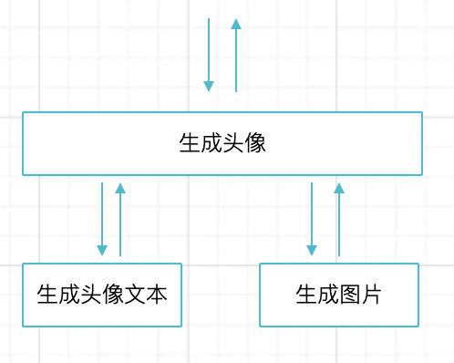
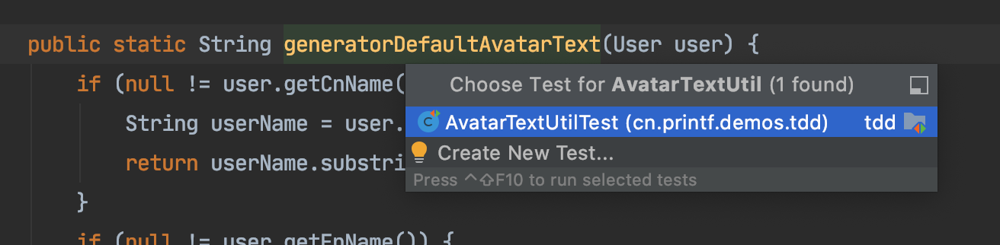

# 测试驱动设计（TDD）

## 理解 TDD

### 什么是 TDD?

TDD，是测试驱动开发（Test-Driven Design）的英文缩写，就一句话解释来说，就是通过编写测试来驱动完成业务代码的完成。TDD 是 XP（Extreme Programming）的核心实践，它的主要推动者是 Kent Beck。

### TDD 写代码是什么样子的？

**一般的软件开发过程**

- 获取需求
- 做简单的设计
- 在大脑中规划需要那几个类，大概用什么设计模式
- 开始编写代码
- 发现有些类设计多余了，删除了，有些类不满足，增加设计
- 需求好像不清晰，和产品经理确认
- 一口气写完所有代码，心里没地儿，造数据跑一下
- 调试
- 解决了几个蠢问题，跑起来了
- 提测，QA 报 bug
- 造数据，找到 bug 原因了，修复
- 修复几次，代码变烂，过一段时间自己都看不懂了

**使用 TDD 开发的过程**

- 获取需求
- 做简单的设计
- 分解任务
- 针对单个任务编写单元测试，只关心输入输出
- 编写实现，让单元测试能跑通
- 提交代码，进入下一个任务
- 联调，手动测试下，一般没有问题，如果有问题使用 git diff 差异，快速发现问题
- 重构，利用单元测试保护，消除代码坏味道
- 提交测试，如果有问题，使用单元测试发现问题

使用 TDD + 小步提交编写代码熟练后可以做到代码 “一把过”，避免反复调试，轻松写出 bug free 的代码。TDD 过程中的任务拆解和小步提交很重要，任务拆解可以让自己的关注点在某一刻更加专注，小步提交可以在遇到的问题时，快速回溯降低解决问题的成本。

### TDD 的价值是什么？

我相信读者朋友一定或多或少的了解过 TDD。我第一次了解到 TDD 是 2012 年阅读到一本 Angularjs 的书籍，讲解通过测试驱动开发前端项目。说实话，这本书对 TDD 的初学者来说具有一定的误导性，应该前端开发的测试逻辑完全不一样，很多时候不能一概而论

对于 Java 来说，天生的适合 TDD 编写业务代码，因为 Java 语言适用场景大多是编写很多业务逻辑的应用程序。换句话说，业务复杂度低于技术复杂度。

接触 TDD 的开发者往往都会有一个疑问，为什么需要 TDD 呢？为什么需要先编写测试再编写业务代码呢？

一些书籍给出的答案是，TDD 可以减少开发时间、缩短产品交付时间、提高产品质量，以及设计出更好软件架构等诸多好处。然而实际体验并不是这样，只要我们需要去编写测试代码，就必须付出额外的时间用于编码，去处理各种为了测试而产生的问题。良好建模的情况下，一套 CRUD 代码，对于一个实习生来说也可能就半天时间，但是如果要求他使用 TDD 可能得再花一天时间修复测试。

**TDD 实际上是反人性的，人们连测试都不愿意写，还会乐意先编写测试再写实现吗**。

想要在项目中说服自己和团队使用 TDD 比如充分理解 TDD 的价值，而不是盲目的认为 TDD 是好东西就逼迫团队 TDD。在一些公司，有一些团队主管要求团队成员必须 TDD 或者 100% 的代码覆盖率，导致团队人员陆续出走。

工程师的悲哀在于，隔壁桌子的人在编写中间件、公共类库，而自己在捣腾业务代码调用 API。

一个完整的软件产品中，大概有 20% 是核心代码，而 80% 都是胶水代码。显然，我们不应该粗暴的设定为所有的代码都要按照同样的质量交付和设计。这些核心代码往往不会特别的依赖外部系统，往往特别适合编写单元测试，用 TDD 也特别简单。对于一些胶水代码，编写测试时需要模拟大量的依赖组件，这些依赖组件并没有被测试到，单元测试的成本高，但是价值非常低。

我曾经一度抵触 TDD，原因在于 CRUD 代码确实不太好编写单元测试和 TDD，使用了 TDD 也需要额外的时间去调试。但是在一个中间件项目中，我主动使用 TDD 并让测试覆盖率接近 100%，因为这个中间件会被整个系统的所有服务用到。

因此，在你需要 TDD 的代码中，全力 TDD，而不要在胶水代码中浪费生命。

### TDD还能干吗？

虽然 TDD 是英文 Test-Driven Design 的缩写，但是在工作中更愿意叫它测试驱动设计。TDD 这个词有多重含义：

- Test-Driven Development，测试驱动开发。通过测试优先的方式驱动业务编码的实现，提高代码质量。
- Test-Driven Design，测试驱动设计。通过提前设计验收条件，然后来进行软件设计，并不局限于代码的编写。正是因为此， TDD 这个概念被延伸到各个地方。这种思想，提倡在任何软件设计活动中，优先考虑如何有效的验证结果，再开始设计，比如提前定义系统容量和性能指标。
- Task-Driven Development，任务驱动开发。通过将最终需要完成的任务拆解成为子任务，每一次只关注一个任务，最终完整整体的任务。

TDD 被赋予了多重含义，导致不是那么容易理解。测试驱动设计，被越来越多的人接受。生活中也可以利用 TDD 这种思想，分解任务、明确验收任务、小步执行任务。对于生活中的任务管理和时间管理都有帮助。

在管理学上有一种方法论和 TDD 非常相似，那就是 PDCA。PDCA循环是美国质量管理专家休哈特博士提出的，后由戴明采纳普及，又称戴明环，是一种工作流方法。它由四个阶段构成，并循环阶梯式上升：

- P——Plan（计划）制定计划，明确目标，分解任务，制定检查点。
- D——Do（执行）执行任务，一次完成一个任务。
- C——Check（检查）检查任务，识别那些完成，那些做的好，那些做的不够好。
- A——Action（动作）根据检查点反馈，进行修正处理，进入下一个循环。




## TDD 操作指南

"红灯-绿灯-重构" 三个过程是 TDD 的经典方法，它的含义实际上代表了当前工作的状态：

- 红灯，测试爆红，代码不工作，需要处理。
- 绿灯，测试通过，代码能工作，但是并不代表代码是最合适的。
- 重构，测试通过，但是有代码坏味道，需要重构处理，并重新通过测试



### 任务拆解

将需求分析成多个可以具体实现的任务，一般是一个 public 方法为粒度，它约定了这些方法的输入输出。可以简单的在纸、白板、在线绘图工具设计，给自己列一个任务清单。

每完成一个任务，就把这个清单项目划掉。

### 编写测试

挑选一个任务，为这个任务准备一些空的类和方法，并编写测试。并且准备这个任务的输入数据和测试断言。运行这个测试，它应该失败，否则就是测试设置有问题。

断言一定是想要这个方法所实现的目标，刚开始时这种方法不适应，因为对于编程经验不足的软件工程师来说，很难预测出一个方法将要输出的数据内容和格式。

但是，不断训练自己像计算机一样的思考，一旦度过这个痛苦阶段，可以让自己编写代码的过程有质的飞跃。很快就能体会到 “一把过” 的快感，体会到编程的快感。

### 编写实现

为这个测试编写实现，不要试图让代码编写的多完美（比如魔法数字、超大的方法），这个阶段只关心如何实现业务功能，让测试跑过即可。我们往往只为 public 方法编写测试，先不要拆分方法、抽取常量、设计各种模式。

这一步只需要关注在让业务能够顺利运行即可。这一步不仅需要运行当前的测试，还需要让所有的测试能运行通过。

**一旦通过测试，无论代码多么丑陋，一定要提交代码到版本管理仓库。**

### 重构

测试通过后，开始关心代码结构。事实上我们平时也是这么工作的，先写一个 demo 让代码能跑起来，再进行优化。使用 TDD 带给你的唯一不同点在于，这个时候你的代码已经提交到代码仓库，可以在任何一次破坏性的修改时找回来。另外，因为测试先行，能保证重构基本安全可靠，这是非常重要的一件事。

当然不是每一个 TDD 周期，都需要重构。当开发技巧日趋成熟时，需要重构的代码越来越少。

当然，需要注意的是重构是指不修改任何既有功能的情况下优化代码，**重构期间业务代码和测试代码只能同时被修改一处。**

### 循环

当一个任务完成上面的步骤之后，就可以进行下一个任务了，循环的过程可以想象成乒乓球运动，每一次测试-实现切换，就是一次乒、乓的接球和打出。

看起来 TDD 让写代码变得更加繁琐，但是在编写完一个任务后，可以暂时将它从大脑中清除掉，专注于下一个任务。使用 TDD 可以进入专注状态，有一些 TDD 导师喜欢把这种状态叫做心流，进入心流后会沉浸到编码中，有时候也是一种有意思的体验。

以上就是 TDD 的全部过程，过程非常简单，和学任何新东西一样，需要大量练习，让自己顺利渡过一段痛苦期。

下面用一个实例，来演示一个 TDD 过程。

## TDD 实例演示

本次实例演示为一个某项目的真实需求，我们使用敏捷的用户故事来设定需求，AC 指的是验收条件（Acceptance Criteria）：

> 某应用程序需要，根据用户信息生成默认头像 （类似 Gmail）。用户信息中有英文名、中文名、性别。
>
> AC 1 如果有中文名优先使用中文名中的后两个汉字，如果有英文名使用大写的首字母，如果均没有使用返回空。
>
> AC 2 图片的文字使用白色，如果性别为男性（male）使用蓝色背景，为女性（female）使用红色背景，为空则说明性别保密，使用灰色背景。
>
> AC 3 图片尺寸为 60* 60px，MIME 格式为 jpg，使用 base64 返回

### 任务分解

每一个 AC 代表验收条件，并不能拿来直接作为任务。假定不需要解析用户信息的数据，这个需求可以分为 1 + 2 个部分：

1. 根据用户信息生成 base64 的头像
   1. 根据用户信息生成图片的文本标签
   2. 根据文本生成图片

新手往往会犯两个错误。

一个错误是将所有的代码放写到一起，直接就不做任务分解。因为这个业务需求本身就不复杂，往往看不出来要拆分出来。如果不使用 TDD 会发生什么呢（我刚毕业的样子）？先写一个大文件，所有代码先堆到一起，尝试调通再说，完成所有的工作再提交。如果中途出现问题，使用 System.out.println() 打印出相关内容，或者使用单步调试，需要花费很多时间解决问题。

另外一个错误是，分解任务，但是所有任务都是流水账。比如上面的任务分解有两个层次，新手会直接使用 1.2 根据文本生成图片的方法去调用 1.1 的生成文本标签，造成这些方法无法单独测试，以及后期的复用。

### 搭建环境

junit 的环境可以参考之前的内容，也可以直接 fork github 代码仓库。参考 https://github.com/linksgo2011/java-unit-testing-book/tree/master/tdd

### TDD 回合1
第一个任务是根据用户信息生成头像所使用的文本，我创建了一个 AvatarTextUtil 类和 空的静态方法 generatorDefaultAvatar：

```java
public class AvatarTextUtil {
    public static String generatorDefaultAvatar(User user) {
        return "";
    }
}
```

同时创建 User 类，作为参数：

```java
public class User {
    private String cnName;
    private String enName;
    private String gender;
	  ....
}
```

编写一个正向测试，期望获得正确的结果：

```java
public class AvatarTextUtilTest {
    @Test
    public void should_generated_user_avatar_text_for_zh() {
        User user = new User() {{
            setCnName("王老五");
            setEnName("Mike");
        }};
        Assert.assertEquals("老五", generatorDefaultAvatarText(user));
    }
}
```

毫无疑问这个时候测试会失败，因为我们返回的是一个空字符串，如果测试通过了，说明断言是无效的。接下来我们编写实现，返回中文名称的后两位。

接下来编写实现：

```java
public static String generatorDefaultAvatarText(User user) {
    String userName = user.getCnName();
    return userName.substring(userName.length() - 2);
}
```

再次运行，这个时候测试通过了，我们完成了一个最基本的实现，一般我们可以把它称为 “baby step”。这个时候你可能猜到我们接下来要做什么了，接下来会去处理中文名不存在时通过英文名生成头像文本的逻辑。经过这么几轮的测试-编码，我们可以考虑到几乎所有的情况。

那么我们工作中一直都是这么反复在编写测试和实现中切换的吗？一般来说是的，这里不得不介绍下 TDD 的不同流派。

1. 快速切换流。领取一个任务，编写一个用例，编写实现，运行测试，提交代码，直到这个任务完成。
2. 用例预演流。领取一个任务，尽可能考虑编写多个常见用例，编写单个任务的实现，统一运行测试，修复问题，提交代码。

我比较倾向于第二种，领取任务时，也需要稍稍设计，考虑常见的用例和边界情况，并完成实现。

限于篇幅，我直接放上完成的三个测试用例（实际上还需要测试其他边界值，比如字符长度不够，但是对于应用程序来说最好在入口做好即可，否则这种校验会爆炸）

```java
public class AvatarTextUtilTest {
    @Test
    public void should_generated_user_avatar_text_for_zh() {
        User user = new User() {{
            setCnName("王老五");
            setEnName("Mike");
        }};
        Assert.assertEquals("老五", generatorDefaultAvatarText(user));
    }

    @Test
    public void should_generated_user_avatar_text_for_cn() {
        User user = new User() {{
            setCnName(null);
            setEnName("Mike");
        }};
        Assert.assertEquals("M", generatorDefaultAvatarText(user));
    }

    @Test
    public void should_not_generated_user_avatar_text_for_empty_user_info() {
        User user = new User() {{
            setCnName(null);
            setEnName(null);
        }};
        Assert.assertEquals(null, generatorDefaultAvatarText(user));
    }
}
```

这是最终的实现代码：

```java
public static String generatorDefaultAvatarText(User user) {
    if (null != user.getCnName()) {
        String userName = user.getCnName();
        return userName.substring(userName.length() - 2);
    }
    if (null != user.getEnName()) {
        String userName = user.getEnName();
        return userName.substring(0, 1).toUpperCase();
    }
    return null;
}
```

完成测试的代码，都别忘记提交到代码仓库，并推送到远程分支。

### TDD 回合2

第一轮编写我们完成了通过用户信息生成头像文本，我们可以得到下面几个文件：



接下来我们领取任务第二个任务，ImageUtil 中编写一个水印图片静态方法，通过传入文本和背景颜色就可以生成一张 base64 的图片。

这种情况下很难提前写出单元测试的断言，因此可以不必强求每次都提前写出断言。TDD 的精髓并不是要求提前就要完成所有测试编写，**真正的含义在于提前想明白有哪些验证条件**。

测试生成的图片：

```java
@Test
public void should_generate_wager_mark_image() {
    Assert.assertEquals("data:image/jpg;base64,/9j/4AAQSkZJRgABAgAAAQABAAD/2wBDAAgGBgcGBQgHBwcJCQgKDBQNDAsLDBkSEw8UHRofHh0a\n" +
            "HBwgJC4nICIsIxwcKDcpLDAxNDQ0Hyc5PTgyPC4zNDL/2wBDAQkJCQwLDBgNDRgyIRwhMjIyMjIy\n" +
            "MjIyMjIyMjIyMjIyMjIyMjIyMjIyMjIyMjIyMjIyMjIyMjIyMjIyMjIyMjL/wAARCAA8ADwDASIA\n" +
            "AhEBAxEB/8QAHwAAAQUBAQEBAQEAAAAAAAAAAAECAwQFBgcICQoL/8QAtRAAAgEDAwIEAwUFBAQA\n" +
            "AAF9AQIDAAQRBRIhMUEGE1FhByJxFDKBkaEII0KxwRVS0fAkM2JyggkKFhcYGRolJicoKSo0NTY3\n" +
            "ODk6Q0RFRkdISUpTVFVWV1hZWmNkZWZnaGlqc3R1dnd4eXqDhIWGh4iJipKTlJWWl5iZmqKjpKWm\n" +
            "p6ipqrKztLW2t7i5usLDxMXGx8jJytLT1NXW19jZ2uHi4+Tl5ufo6erx8vP09fb3+Pn6/8QAHwEA\n" +
            "AwEBAQEBAQEBAQAAAAAAAAECAwQFBgcICQoL/8QAtREAAgECBAQDBAcFBAQAAQJ3AAECAxEEBSEx\n" +
            "BhJBUQdhcRMiMoEIFEKRobHBCSMzUvAVYnLRChYkNOEl8RcYGRomJygpKjU2Nzg5OkNERUZHSElK\n" +
            "U1RVVldYWVpjZGVmZ2hpanN0dXZ3eHl6goOEhYaHiImKkpOUlZaXmJmaoqOkpaanqKmqsrO0tba3\n" +
            "uLm6wsPExcbHyMnK0tPU1dbX2Nna4uPk5ebn6Onq8vP09fb3+Pn6/9oADAMBAAIRAxEAPwDxyiii\n" +
            "v3E8wKKKKACiiigAooooAKKKvaP/AGV/asP9t/bf7O+bzvsW3zfunbt3cfexnPbNTKXLFytewwtd\n" +
            "Hv73Sr/U7eDfZ6f5f2mTeo8vzG2pwTk5I7A+9Mg0vULmCOeCxuZYZZxbRyRwsyvMRkRggYLEfw9a\n" +
            "+n7PXRD4bu9Q1nVtf0a2fb5NxrENnDKCu4sscaoSWIU8MhJGNo71538U/F1vq1jayPZ+L9Hv4GEm\n" +
            "nxXUCW8BkVhukPO8sFOAQflJHTJz85hc7xGIr+yVJWva6bdtF5K+u9tluur1lTSV7nmv/CF+Kv8A\n" +
            "oWdZ/wDACX/4mquoeHta0mBZ9S0fULOFm2LJc2zxqWwTjLADOAePavarG7020+HeqXMnxO1adL28\n" +
            "jtI9UeC4zbOmJNiJneCy7stkAggdufOPiFDqemT6dZT+K9Q16wvLOLUIHuWkVcOXCnY7Ng4HXg/N\n" +
            "iunB5lWr1vZySWrXwzV7JN2urfJ6ilBJXOKooor3DIKvaPrF/oGqw6npk/kXkG7y5Nitt3KVPDAj\n" +
            "oT2qjRUyjGcXGSumM9t0b4mRX3g6yhvPHFzouuRTzG6lk00Xa3Cs5YYG0gAAgDBXGCNuNpGHr+t+\n" +
            "FLzT7W01bxXrniN5dQe6uZ7aOSDyY/KYKiRSt5YO9gQQvC7hxwD5dRXkwyWhTqOdNtXbeiit/Pl5\n" +
            "rLorluo2rM9Yu/F/w6vPBVh4Ukh8UiwspzPHIq2/mliXOCd2MfvG7DoKx/GniDwVr+lWn9nR6+mo\n" +
            "6fYw2Fp9oWERNHG3V9pJ3bS3TAzjivP6K1pZVSpTU4yldNvfq9/v6ic21YKKKK9MgKKKKACiiigA\n" +
            "ooooAKKKKAP/2Q==", watermarkImage("老五", Color.BLUE));
}
```

测试生成水印图片的实现：

```java
public static String watermarkImage(String text, Color color) {
    Font font = new Font("Default", Font.PLAIN, 16);

    BufferedImage image = new BufferedImage(60, 60,
            BufferedImage.TYPE_INT_BGR);
    Graphics g = image.getGraphics();
    g.setClip(0, 0, 60, 60);
    g.setColor(color);
    g.fillRect(0, 0, 60, 60);
    g.setColor(Color.white);
    // 设置画笔字体
    g.setFont(font);
    Rectangle clip = g.getClipBounds();
    FontMetrics fm = g.getFontMetrics(font);

    int ascent = fm.getAscent();
    int descent = fm.getDescent();
    int y = (clip.height - (ascent + descent)) / 2 + ascent;
    int x = (60 - 16 * text.length()) / 2;
    g.drawString(text, x, y);
    g.dispose();

    // 输出 jpg 图片
    ByteArrayOutputStream baos = new ByteArrayOutputStream();//io流
    try {
        ImageIO.write(image, "jpg", baos);//写入流中
    } catch (IOException e) {
        e.printStackTrace();
    }
    byte[] bytes = baos.toByteArray();
    BASE64Encoder encoder = new BASE64Encoder();
    String base64 = encoder.encodeBuffer(bytes).trim();
    return "data:image/jpg;base64," + base64;
}
```

可以看到这段代码是非常差的，但是我们通过 TDD 的方式编写了测试（虽然只有一个），我们可以考虑重构这个方法。可以直观的识别到的代码坏味道是：

1. 魔法数字
2. 过长且职责的不清晰的方法

可以访问 github 中的示例代码，查看重构后的代码。

### TDD 回合3

我们已经得到了两个充分测试的方法：生成头像文本、通过文本生成水印图片，并重构了相关实现，接下来只需要编写一点胶水代码封装成最终的 AvatarService 即可。

对于胶水层的代码，只需要测试和它相关的逻辑即可。比如在这个场景中，根据不同的性别生成不同背景颜色的头像，对于 AvatarService 只需要编写三个测试用例，分别是：男性、女性、未知性别者即可。

这一轮的 TDD 后增加了 AvatarServiceTest 测试类和 AvatarService 实现类。

```java
public class AvatarServiceTest {
    AvatarService avatarService = null;

    @Before
    public void setUp() throws Exception {
        avatarService = new AvatarService();
    }

    @Test
    public void generate_user_default_avatar_for_male() {
        User user = new User() {{
            setCnName("王老五");
            setEnName("Mike");
            setGender("male");
        }};
        Assert.assertEquals("略", avatarService.generateUserDefaultAvatar(user));
    }

    @Test
    public void generate_user_default_avatar_for_female() {
        User user = new User() {{
            setCnName("王丽丽");
            setEnName("Mike");
            setGender("female");
        }};
        Assert.assertEquals("略", avatarService.generateUserDefaultAvatar(user));
    }

    @Test
    public void generate_user_default_avatar_for_null_gender() {
        User user = new User() {{
            setCnName("王丽丽");
            setEnName("Mike");
            setGender(null);
        }};
        Assert.assertEquals("略", avatarService.generateUserDefaultAvatar(user));
    }
}
```

这里的三个用例对应的实现类中三个不同的分支：

```java
public class AvatarService {

    public String generateUserDefaultAvatar(User user) {
        String avatarText = generatorDefaultAvatarText(user);
        if ("male".equals(user.getGender())) {
            return watermarkImage(avatarText, Color.BLUE);
        }
        if ("female".equals(user.getGender())) {
            return watermarkImage(avatarText, Color.RED);
        }
        return watermarkImage(avatarText, Color.gray);
    }
}
```

如果这里分层非常深，则可以选择使用 mock 工具，将依赖的方法 mock 掉，让测试看起来更加清晰。

虽然我们还没有考虑完所有的边界情况，但是还是得到了一个非常高的测试覆盖率，使用 Intellij IDEA 可以方便的查到测试覆盖率。



除了我们有一个文件 IO 的异常外，覆盖了所有的代码。一般来说，使用 TDD 在编写代码的过程中，可以保持清晰的逻辑，最终也能得到较为高质量的代码。

## TDD 技巧

### 任务拆解技巧

TDD 最难的地方就是任务拆解，而这项运动需要大量的实践和对生活入微的观察。任务拆解不仅仅发生在 TDD 中，任何时候编写代码都需要任务拆解。

大多数人任务拆解困难是因为对业务场景的上下文没有梳理清楚，同时把面向对象和函数式编程的两种思维含混不清。

**上下文**

软件开发是现实生活在计算机中的投影，认识到我们生活中不断切换的上下文，会大大提高软件开发的能力。我们在编写代码前，可能会绘制流程图。比如根据前面的演示示例，可能会画出这样的流程图：



通过流程图来表达确实没问题，但是容易忽略一个问题，流程图的抽象层次是不同的。生成头像文本，实际上和生成图片没什么依赖关系，应该是上一层抽象来编排的，这样任务拆解就清晰很多，不同的抽象实际上是站在不同的上下文思考问题。



对于生成头像这个方法，有点类似我们说的 “胶水” 代码，只需要跑一个正向测试用例（happy pass）即可，大部分的用例都可以在具体的实现中来完成。

**函数式和面向对象**

任务拆解难的另外一个原因是把函数式和面向对象两种思维方式搞混了。因为 Java 代码的业务逻辑都必须通过类来承载的，即使是静态方法其实也是对象。

函数式和面向对象最大的区别是一个无状态，一个有状态，函数式更接近计算机的运行模式，而面向对象更接近人类在现实世界的思维模式。

**任务的粒度**

有些刚接触 TDD 的工程师会对任务的粒度感到困惑，不知道以什么粒度为单位拆分任务。实际工作和培训告诉我们，任务的粒度并不是越细越好，有一些书会推荐这么做（建议小任务，快速切换），其实操作比较困难。

比较建议的参考标准是 一个 public 方法为一个任务，这样编写测试和组织类会更加方便。如果需要将 public 方法进行重构，拆分出更细的 private 方法，只需要增加测试用例即可，不需要修改原来的测试用例，尽量保持输入输出的稳定。

### 没有标准的 TDD 

有一些 TDD 导师喜欢设定一些 TDD 规则，可能在培训中会有一定好处。但是在工作中，坚持使用 TDD 的模式来编写代码，比 “正确” 的 TDD 最佳实践重要的多。

TDD 只是一种方法，不要陷入各种 TDD 流派宣传的繁琐仪式中。时刻注意我们是为了编写软件，而不是为了练习 TDD。

### 善于使用快捷键

在使用 TDD 的过程中需要不断在测试和实现中跳转，借助Intellij IDE 的能力可以提高编写测试的效率，这里介绍几个在实践 TDD 的过程中常用的快捷键（默认 Mac，如果系统不一致，可以通过右键的上下文菜单找到对应的快捷键）。

**创建测试**

在方法上，使用 Command + Shift + T 快速创建测试。



使用上下文菜单：右键 -> Generate -> Tests

**跳转到相应的测试**

和创建测试使用同样的快捷键，但是必须按照一定规则才能导航过去，所以建议使用快捷键在测试目录下创建测试。

**运行当前上下文的测试**

在方法或者类上，使用 Control + Shift + F10 运行测试。可以使用上下文菜单中的 Run…… 选项查看快捷键。

**重新运行上一次的测试**

在任何地方，使用 Shift + F10 运行上一次的测试，在 TDD 的过程中会反复运行测试，这个快捷键非常常用。

### 只为必要的代码编写测试

刚开始学习 TDD 的人，或者对 TDD 有原教旨般信仰的人，会认为测试越多越好。那么代价是编写测试的代价非常高，另外随着测试变多，运行测试的速度也会变慢。

绝对不是测试用例越多越好，而是应该用尽可能少的用例保障代码质量。这些情况其实没必要编写测试用例，以及 TDD ：

1. 一次性代码或者调研的代码
2. 调用第三方 API，这个 API 被验证时可以信任的，比如 JDK 中操作文件的 API