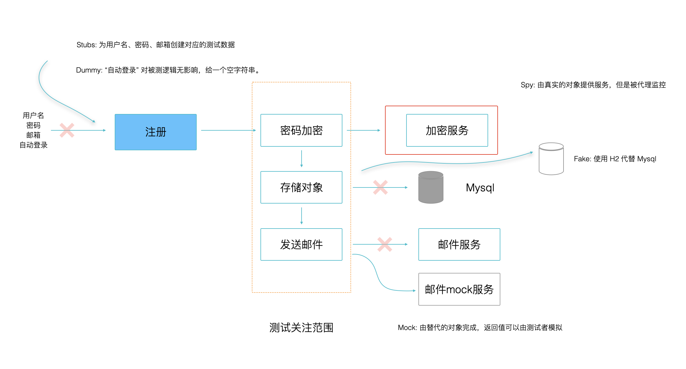

# 测试替身: Mock、Spy、Stub

对于一个应用程序或者一个系统而言，很难给你一个纯粹的类进行单元测试。对象之间的依赖往往交织到一起，需要拆成各个单元才能逐个击破，也是单元测试的目的。

需要将这些交织到一起的对象拆开，需要一些工具，例如模拟一些数据、替换一些具有某些特定行为的类等。  网站 xunitpatterns.com 把这些工具称为 Test Double，翻译过来就是”测试替身“。

Martin Fowler 为了让这些概念更容易理解，在他的网站上重新更加具体的定义了它们：

- **Dummy** 被用来仅仅作为填充参数列表的对象，实际上不会用到它们，对测试结果也没有任何影响。
- **Fake** 一些假的对象或者组件，测试过程中会被用到。例如内存数据库 h2，假的用于用户鉴权的 Bean，一般只会在测试环境下起作用，不会应用于生产。
- **Stubs** 为被测试对象提供数据，没有任何行为，往往是测试对象依赖关系的上游。
- **Spies** 被依赖对象的代理，行为往往由被代理的真实对象提供，代理的目的是为了断言程序运行的正确性。
- **Mocks** 模拟一个具有特性行为的对象，在测试开始前根据期望提供需要的结果。被测试对象往往调用这个对象的方法时，根据条件得到不同的输入，从而满足测试对象的不同场景。例如，mock 数据库的存储层，返回正常数据、空或者丢出异常等情况。

实际开发中，根据测试框架的实现，对定义有一部分出入。但大体上不会差太多，框架往往会提供 Mock、Spy 相关实现，Stub、Fake、Dummy 则需要自己配置或者实现。

下面这张图简单说明了这些测试替身分别有什么用，项目中不必全部引入，根据需要使用即可。我拿用户注册这个例子作为说明，我们写的单元测试会聚焦于测试部分的代码，所以其他部分能模拟就想办法模拟。



下面我们使用 Mokito 来测试依赖关系复杂的对象。

## Mokito 基本用法

Mokito 最常用的方法是 mock、spy 两个方法，大部分工作都可以通过这两个静态方法完成。mock 方法输入一个需要模拟的类型，Mokito 会帮你构造一个模拟对象，并提供一系列方法操控生成的 mock 对象，例如根据参数返回特定的值、丢出异常、验证这个 mock 对象中的方法是否被调用，以何种参数调用。

### 使用 Mock

在实例代码中的 stubs  模块中有一个 UserService 对象，用来演示用户注册的逻辑。在 register 方法中，注册的过程有密码 HASH、数据持久化、发送邮件三个主要流程，实际的注册方法必然更加复杂。这里做了大量简化，让我们关注于单元测试。

```java

public class UserService {
    private UserRepository userRepository;
    private EmailService emailService;
    private EncryptionService encryptionService;

    public UserService(UserRepository userRepository, EmailService emailService, EncryptionService encryptionService) {
        this.userRepository = userRepository;
        this.emailService = emailService;
        this.encryptionService = encryptionService;
    }

    public void register(User user) {
        user.setPassword(encryptionService.sha256(user.getPassword()));

        userRepository.savedUser(user);

        String emailSubject = "Register Notification";
        String emailContent = "Register Account successful! your username is " + user.getUsername();
        emailService.sendEmail(user.getEmail(), emailSubject, emailContent);
    }
}
```

为了演示 Mokito 基本的使用方法，这里没有使用 Spring 框架，需要自己通过构造函数组织对象依赖关系。

我们的测试目标是 register 方法，和之前的示例不同，这里的被测试方法没有返回值，如果没有发生异常就代表功能和逻辑正常，因此无法根据返回值断言。另外，这个方法中会去调用其他对象，这在依赖关系如网状的现实对象依赖关系中不算什么。

UserService 的构造方法需要传入 userRepository、emailService、encryptionService 三个对象，否则无法工作。

我们来编写一个测试，并使用 Mokito 创建我们需要的下游对象。

```java
public class UserServiceTest {

    @Test
    public void should_register() {
        // 使用 mokito 模拟三个对象
        UserRepository mockedUserRepository = mock(UserRepository.class);
        EmailService mockedEmailService = mock(EmailService.class);
        EncryptionService mockedEncryptionService = mock(EncryptionService.class);
        UserService userService = new UserService(mockedUserRepository, mockedEmailService, mockedEncryptionService);

        // given
        User user = new User("admin@test.com", "admin", "xxx");

        // when
        userService.register(user);

        // then
        verify(mockedEmailService).sendEmail(
                eq("admin@test.com"),
                eq("Register Notification"),
                eq("Register Account successful! your username is admin"));
    }
}
```

mock 对象帮我们创建了需要的模拟对象，而非真实的对象。通过 given/when/then 的方式组织测试代码，让测试看起来更为清晰。

对 register 对象来说，只需要知道验证传给 sendEmail 方法的参数是否按照我们预期即可，并不需要关心发送邮件内部，那是下一个单元测试需要关心的事情。

因此可以使用 verify 方法，传入模拟对象，并调用方法。verify 还可以传入验证的次数，如果是一个循环，被模拟的对象可能不止一次被调用，不传入的情况下默认是 1。 verify(mockedEmailService) 等价于  verify(mockedEmailService, 1)。

```java
verify(mockedEmailService).sendEmail(
                eq("admin@test.com"),
                eq("Register Notification"),
                eq("Register Account successful! your username is admin"));
```

另外这段代码中还需要验证发送邮件的参数是否是我们期望的。我们需要验证发送邮件的地址是 ”admin@test.com“，发送的内容中包含了用户名等信息。

这里使用了，eq 方法进行对比，需要注意的是 eq 方法和 assertThat 中的 equalTo 不太一样。这里是对参数进行验证，eq 方法来自于 ArgumentMatchers 对象，需要特别注意。


除了 eq 之外还有一些常用的验证器：

- notNull 非空校验
- same 引用校验
- isNull 空校验
- contains 包含
- matches 正则校验，比较常用
- startsWith、endsWith 字符串比较


### verify 比较对象

上面的 verify 


# 测试静态、私有方法


## powermock 入门


## 神奇的 whitebox