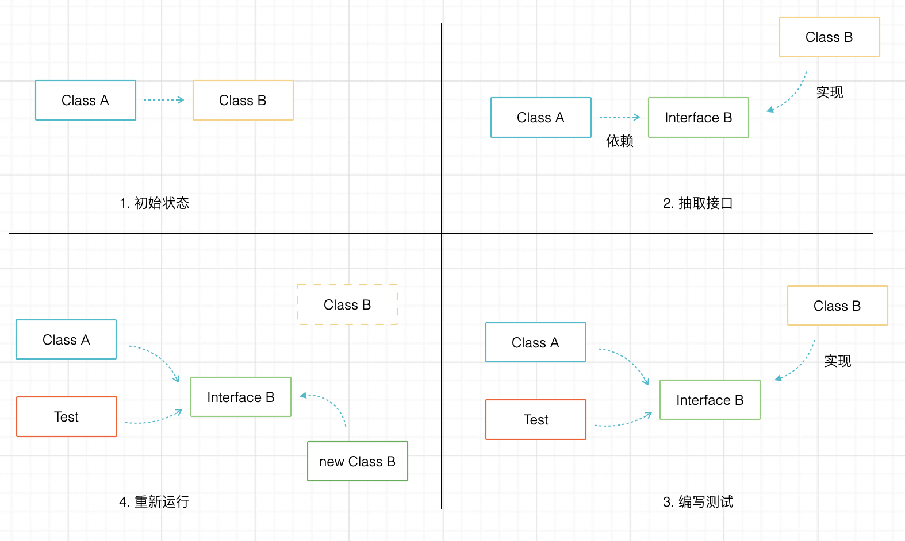

# 测试守护重构

作为程序员不得不接受的现实是，大多数系统在接手时就已经是遗留系统了。我在最近几年都没有参与新系统开发，不得不接手遗留系统的改造。改造遗留系统的成本实际上比写新的软件要大很多，毕竟就像给高速上飞驰的汽车换轮子。不仅不能引入新的错误，原来的错误在某种程度上也需要“将错就错”，否则对现有用户、现有数据而言顺手修复了一个 bug 反而会带来额外的问题。

要想改造遗留系统不是这么简单地事情，需要考虑的事情很多，而测试就是其中很重要的部分。没有单元测试、E2E 测试的系统改造起来难度非常大，所以这也是我热衷于在每个项目中引入单元测试、E2E 测试的原因。

对遗留系统重构的逻辑非常直接但并不是直接上手修改代码就好了，需要有几个过程，和几个注意事项。

遗留系统改造的过程我总结为以下几个：

1. 抽取接口，使组件替换成为可能。
2. 理解原有系统，并补充测试，让测试覆盖率达到一定程度，使用存量数据作为输入运行测试。
3. 重新实现接口，替换原有实现。
4. 使用同样的数据作为输入运行测试。

几项特别的注意事项：

1. 使用版本管理工具
2. 充分使用 IDE 的重构工具
3. 使用持续集成环境，让每一次提交都自动构建一次
4. 提前考虑数据迁移的成本，编写迁移脚本，并进行测试

当然这部分重点是讨论怎么编写出可靠的测试，重点不是重构。我在大量的重构（清理屎山）的工作主要分为两类：一类是重构单个方法和类，大部分讲解重构技巧的书籍着重说明这部分；还有一类是重构系统，比如流行的微服务拆分和改造，最讨厌的莫过于伪微服务的修正。

## 理解接口

接口是一种契约，如果这样理解接口重构就好做很多。

要安全的做好重构，必须基于原有的业务规则编写测试，所以我们简单回顾下接口的本质。

以 Java 为例，在强类型的语言中，天然就拥有 interface 的特性。当我们对一个功能要求多个实现的时候，我们可以先通过接口定义出需要的方法，然后使用不同的对象实现。

举个例子，现实生活中，我们想要通过一台计算机把文档或者图片投影到幕布上，同时也需要能通过打印机打印出来，那么投影仪和打印机两台输出设备必须具备支持信息输出的接口。

很多书将接口描述为“抽象”，类就是实现。这种说法没有任何问题，但是从理解上来说没有很好的解释接口的价值。我想要把白炽灯重构为节能灯，就必须遵守之前灯座的契约。

那么测试对于重构的意义就像下图所示，初始状态使用类作为依赖关系，然后抽取测试，基于接口作为测试目标，然后进行重构，最后使用原有的数据通过测试。

广义上的接口多种含义：

1. 语言层面的接口，例如 Java 的 Interface 关键字

2. 系统层面的接口，例如 Windows 操作系统提供的 win32  API

3. 服务之间的接口，也就是我们常说的 API

   

## 语言层面 Interface 测试

在 Spring 的上下文下，重构一个重要的类，最机智的方法是先用 IDE 抽取一个 Interface。然后将这个实现类定义为 Bean，通过接口注入到测试类中，作为测试对象。

## 系统层面 API 测试

## 重构技巧

### 自动且频繁构建

### 使用 IDE 重构

### 数据迁移方法