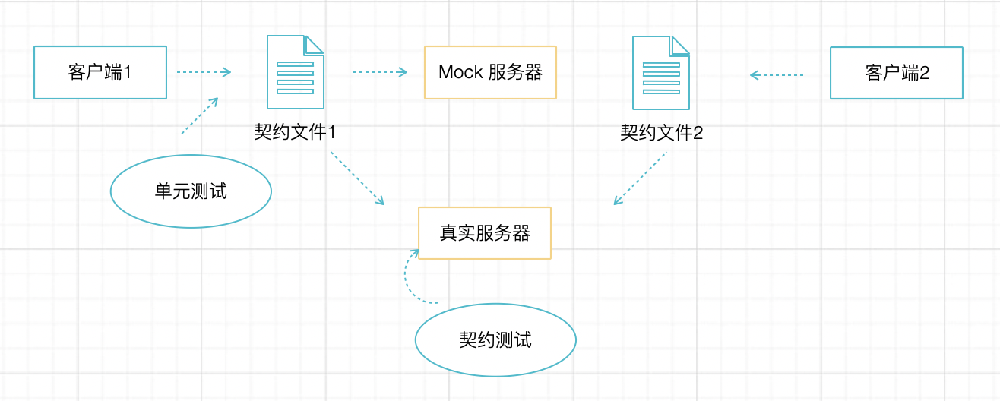
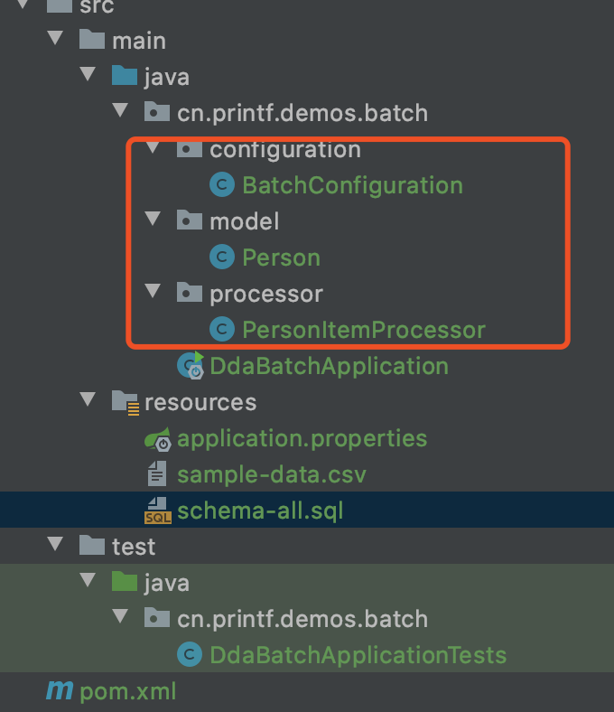

# 测试守护重构

作为程序员不得不接受的现实是，大多数系统在接手时就已经是遗留系统了。我在最近几年都没有参与新系统开发，不得不接手遗留系统的改造。改造遗留系统的成本实际上比写新的软件要大很多，毕竟就像给高速上飞驰的汽车换轮子。不仅不能引入新的错误，原来的错误在某种程度上也需要“将错就错”，否则对现有用户、现有数据而言顺手修复了一个 bug 反而会带来额外的问题。

要想改造遗留系统不是这么简单地事情，需要考虑的事情很多，而测试就是其中很重要的部分。没有单元测试、E2E 测试的系统改造起来难度非常大，所以这也是我热衷于在每个项目中引入单元测试、E2E 测试的原因。

对遗留系统重构的逻辑非常直接但并不是直接上手修改代码就好了，需要有几个过程，和几个注意事项。

遗留系统改造的过程我总结为以下几个：

1. 抽取接口，使组件替换成为可能。
2. 理解原有系统，并补充测试，让测试覆盖率达到一定程度，使用存量数据作为输入运行测试。
3. 重新实现接口，替换原有实现。
4. 使用同样的数据作为输入运行测试。

几项特别的注意事项：

1. 使用版本管理工具
2. 充分使用 IDE 的重构工具
3. 使用持续集成环境，让每一次提交都自动构建一次
4. 提前考虑数据迁移的成本，编写迁移脚本，并进行测试

当然这部分重点是讨论怎么编写出可靠的测试，重点不是重构。我在大量的重构（清理屎山）的工作主要分为两类：一类是重构单个方法和类，大部分讲解重构技巧的书籍着重说明这部分；还有一类是重构系统，比如流行的微服务拆分和改造，最讨厌的莫过于伪微服务的修正。

## 理解接口

接口是一种契约，如果这样理解接口重构就好做很多。

要安全的做好重构，必须基于原有的业务规则编写测试，所以我们简单回顾下接口的本质。

以 Java 为例，在强类型的语言中，天然就拥有 interface 的特性。当我们对一个功能要求多个实现的时候，我们可以先通过接口定义出需要的方法，然后使用不同的对象实现。

举个例子，现实生活中，我们想要通过一台计算机把文档或者图片投影到幕布上，同时也需要能通过打印机打印出来，那么投影仪和打印机两台输出设备必须具备支持信息输出的接口。

很多书将接口描述为“抽象”，类就是实现。这种说法没有任何问题，但是从理解上来说没有很好的解释接口的价值。我想要把白炽灯重构为节能灯，就必须遵守之前灯座的契约。

那么测试对于重构的意义就像下图所示，初始状态使用类作为依赖关系，然后抽取测试，基于接口作为测试目标，然后进行重构，最后使用原有的数据通过测试。


广义上的接口多种含义：

1. 语言层面的接口，例如 Java 的 Interface 关键字

2. 系统层面的接口，例如 Windows 操作系统提供的 win32  API

3. 服务之间的接口，也就是我们常说的 API

   

## 保护“类”级别的重构

首先如果是为一个进行重构，尽量优先选择单元测试而不是集成测试。这样可以快速、安全的进行重构和替换类。

对于很重要的系统而言，应该老老实实的抽取原来的类所有的 public 方法为接口，并将依赖的类进行 Mock。编写足够的单元测试用例后，开始重构，并用同样的测试重新运行。

对于遗留系统而言，最难的地方是不知道原来的业务逻辑，如果原先就不存在单元测试的话，这个是最大的挑战。**“将错就错” 是一个非常重要的原则，重构代码期间不要擅自优化业务逻辑，应该留在重构后来做，单元测试的用例一定要以当前的行为编写，即使看起来非常傻。** 

我在重构一个大型互联网项目的代码时，制造过一个线上环境的小事故，导致用户头像修改。原因是我重构了用户上传头像的业务逻辑，严格按照原来的输入输出编写了单元测试，但是看到代码中文件上传的过程中使用了文件的后缀来获取文件的类型，而不是根据文件的头信息。这种做法会带来安全问题，并且正常的用户也不会这样做，挡掉这种非法操作是一件自然地事情。但是我们的 PC 客户端做了一件非常愚蠢的事情，允许用户在历史投降之间切换，并且历史头像存放到客户端本地环境。在这个过程中，PC 客户端统一将所有允许的图片类型修改为了 PNG，导致用户无法切换默认头像。

对遗留系统而言，重构造成的类似案例非常多。我做过大量关系业务系统组件的重构（高速路换轮子的恶心事儿），有几个技巧比较有效的提高遗留系统单元测试的有效性。

### 提取测试数据

可以利用 **“切面日志法”**，获取足够的真实测试用例经过这个类和方法的测试数据。对于遗留系统而言，单个方法的输入参数、返回值、对下层的方法调用情况比较难获得，所以很多奇葩场景的操作反应到测试数据上面千变万化，漏一些场景就会遇到问题。好在可以利用 java 的切面能力，为需要重构的方法构建切面，通过切面打出参数、返回值、下层方法调用的日志。然后请 QA 进行功能测试，在功能测试的过程中提取这些测试数据，作为测试、Mock verify、断言的数据。


切面日志法，大大提高了我的安全感，实践证明确实有效。操作起来也比较简单， 只需要简单配置 AOP 即可打印出需要方法的输入输出。我们可以使用 jcabi-aspects 这个库，它提供一个 @Loggable 方法的切面实现了这个 AOP。

我编写了一个简单的例子，输出一个 “Hello XX ” 的字符串。

```java
public class HelloService {
    @Loggable
    public String hello(String name) {
        return "Hello " + name;
    }
}
```

执行后可以得到下面这样的日志：


如果使用 Spring Boot 有人封装了 logger-spring-boot  这个库，可以直接引入并通过 @EnableLogger 生效即可使用，无需任何配置。进一步考虑的话也可以用它这些数据通过模板引擎或者 ASM 工具自动生成一些测试代码减少工作量。

即使编写单元测试，也可以用到 Spring。在 Spring 的上下文下，重构一个重要的类，最机智的方法是先用 IDE 抽取一个 Interface。然后将这个实现类定义为 Bean，通过接口注入到测试类中，作为测试对象。

除了利用日志的方式提取测试数据之外，还可以使用一些调试工具来监控方法调用的输入输出。Arthas 是一个开源框架，用于监听在线 Java 进程中的方法调用，通过 attach 到运行的 Java 进程后，通过 watch 命令可以直接监听方法调用情况。

使用它非常简单，先启动被调试的程序，然后用 java -jar 运行 arthas。

```shell
curl -O https://arthas.aliyun.com/arthas-boot.jar
java -jar arthas-boot.jar
```
选择需要附加的 Java 进程：


输入需要执行的命令：


总之，想办法弄到 QA 真实场景的测试数据，是为遗留系统编写单元测试很重要的一环。

### 参考测试覆盖率

即使使用 QA 的测试场景生成的用例，也不会 100% 的覆盖所有的情况（没有 100% 可靠的程序）。但是为了让自己心里有底，需要通过验证单元测试的覆盖情况来补充测试用例。

测试覆盖率其实意义不大，最好通过 IDE 的覆盖情况来增加测试。Eclipse 可以安装一个 Code Coverage 插件，Intellij 默认提供了测试覆盖率的查看。

为刚刚 HelloServiceTest 编写一个简单的测试，然后 run with Coverage


然后查看左边红色部分，即源代码中测试未覆盖的情况。


## 使用契约测试，保护 API 重构

上面为类级别的重构编写单元测试可以提高重构的安全性，但是如果对一个大的系统进行重构，涉及大量的文件，这样做虽然能保证安全，但是成本高昂。

在系统级别的重构时，或者做微服务迁移时，为系统 API（集成测试） 编写测试更具有性价比。系统级别的 API 的测试有几种做法：

1. 使用 Spring 提供的 MockMVC 工具编写 Mock 的 API 测试
2. 使用 rest-assured 提供的工具提高 API 测试的效率
3. 使用契约测试作为轻量级的 API 测试，大部分情况下自动校验字段、和字段类型，以及其他必要的断言。

使用 rest-assured 来编写完整的 API 测试，然后手动为每个字段断言当然可以保证 API 测试的可靠性。但是往往工作量很大，而且字段也容易遗漏。使用轻量级的契约测试可以在“完美的测试”和“没有测试”作为折中的方案。

前面我们说到，API 是一种契约，对于前后端分离的项目，前后端协同开发，契约是一种必不可少的。在以前，我们都是通过口口相传，后来使用文本文档，再后来使用 swagger、raml 等工具动态生成。

在我们开发过程中，如果有一种测试能自动验证我们提供的文档，只要达成了契约，是不是我们可以认为我们重构是相对安全的呢？

有一种自动化测试方法可以做到这点，这就是我们要介绍的契约测试。

### 契约测试介绍

实际上业界软件行业对各种没能达成比较一致的叫法，基本上大家还是各个团队有各自的说法，虽然国标 GB/T 对测试方法做过定义，但是接受度并不高。


我个人的理解而言，单元测试测试类、方法层面，API 和 集成测试说的实际上是同一回事，对系统的 API 进行测试，确定系统的边界。而 E2E 测试则是对完整应用的功能性测试，所以又叫做 Functional Testing。

叫什么名字到不是很重要，只是契约测试容易让人迷惑，我更愿意把它归纳到集成测试中，作为 API 测试的一种轻量级的方法。


对于集成测试而言，主要是保证 API 的用例，需要编写大量的断言，这些断言往往作为 Junit 的断言语句存在，能不能写完整，取决于程序员的自觉性。就一般而言，集成测试要把每个字段都编写到位需要花费不少功夫。

契约测试的理念是，通过一个契约文件对 API 做一些基本的约束，例如字段是否一定要存在，字段的类型是否匹配。在大多数情况下，保障字段的存在和类型的正确性，以及一些其他额外的验证，做到这些就能保证 API 的稳定和安全。至于具体的值和其他用例，则可以由单元测试来验证。


契约文件一般是以 json 的方式出现，可以通过手动调用的方式，在重构前获取契约。然后再重构完成后，由契约测试框架来验证契约是否稳定，从而检查重构过程的中的破坏性的操作。兼具了编写测试的成本和重构的安全性。

```json
// 一个契约文件的示例
{
  "consumer": {
    "name": "dummy-consumer"
  },
  "provider": {
    "name": "product-service"
  },
  "interactions": [
    {
      "description": "Get all products",
      "providerState": "Get all products",
      "request": {
        "method": "GET",
        "path": "/products",
        "headers": {
          "Content-Type": "application/json"
        }
      },
      "response": {
        "body": [
          {
            "id": 1,
            "name": "Book",
            "description": "Some Books",
            "price": null
          }
        ],
        "status": 200
      }
    }
  ],
  "metadata": {
    "pactSpecification": {
      "version": "2.0.0"
    }
  }
}
```

在契约测试的理念中，契约文件最好由消费者驱动编写，然后由 Mock 服务器来验证即可，这种做法的好处是可以验证对多个消费者的影响。



使用这种方式的契约测试更加安全，甚至契约文件也不必手工编写，可以通过客户端的某种测试来生成契约文件。如果消费者驱动，也会为协作带来方便，如果把契约文件存放到一个团队都能访问到的地方（broker）中，则可以作为 API 文档，并且这个这份文档是经过验证，并可靠的。

当然，如果是为了做 API 的重构工作，最好的方式就是提前找 QA 同学走完一套手动测试的用例，录制 API 的请求和返回 JSON 文件，经过修改直接作为契约文件，大大降低重构成本。

下面介绍的 Pact 是契约测试的一种实现，它可以完成消费者驱动的契约测试，但对于重构而言，往往通过手动或者录制的方式编写契约文件。

### Pact 入门

Pact 提供给开发者这样一种测试体验：

1. 我们可以利用手工测试服务器返回的 json 作为断言输入，而不是手动编写每一个测试。
2. 大部分情况下我们验证字段是否存在，以及字段类型，一些特殊的字段使用拓展的验证器，比如随机数、时间等。
3. 契约（一般是 json 文件）可以由消费者提供和驱动编写，并能作为 API 文档使用，甚至可以通过消费者自动生成。

使用 Pact 作为契约测试对微服务改造非常有用，而且使用起来并不困难，下面介绍如何编写一套简单的契约测试来守护 API。为了减少篇幅，可以通过 https://github.com/linksgo2011/java-unit-testing-book/tree/master/contract-testing 获得所有的 demo，我只贴出必要的代码示例。

切入到代码之前，先聊下 Pact 中的几个概念。

- Service Consumer。服务消费者，是指向另一组件（服务提供者）发起HTTP请求的组件。注意这并不依赖于数据的发送方式——无论是GET还是PUT / POST / PATCH，消费者都是HTTP请求的发起者。
- Service Provider。服务提供者，是指向另一组件（服务消费者）的HTTP请求提供响应的服务器。
- Mock Service Provider。模拟服务提供者，用于在消费者项目中的单元测试里模拟真实的服务提供者。
- Interaction。交互，即一组请求、返回。
- Pact file。Pact 契约文件，一般是以 JSON 的形式存在。
- Pact verification。Pact 验证，通过契约文件对服务提供者进行验证。
- Provider state。提供者状态，“状态” 来源于 RESTFul API 的概念，可以理解为一个用例。

Pact 可以有很多编程语言实现，基本上主流的编程语言都有其实现，对 java 来说，我们使用的是 pact-jvm，正如字面的理解，它可以用于其他 JVM 语言的使用。下面用一个小的 product 服务来说明，怎么使用 pact。


引入依赖包：

```xml
<dependencies>
    <dependency>
        <groupId>org.springframework.boot</groupId>
        <artifactId>spring-boot-starter-web</artifactId>
    </dependency>
    <dependency>
        <groupId>org.springframework.boot</groupId>
        <artifactId>spring-boot-starter-data-jpa</artifactId>
    </dependency>
    <dependency>
        <groupId>com.h2database</groupId>
        <artifactId>h2</artifactId>
    </dependency>
    <dependency>
        <groupId>org.springframework.boot</groupId>
        <artifactId>spring-boot-starter-test</artifactId>
        <scope>test</scope>
    </dependency>
    <dependency>
        <groupId>au.com.dius</groupId>
        <artifactId>pact-jvm-provider-spring</artifactId>
        <version>4.0.0</version>
        <scope>test</scope>
    </dependency>
</dependencies>
```

编写一个 Controller 返回 product 列表:

```java 
@RestController
@RequestMapping("/products")
public class ProductController {

    private ProductService productService;

    private ProductAssembler productAssembler;

    @Autowired
    public ProductController(ProductService productService, ProductAssembler productAssembler) {
        this.productService = productService;
        this.productAssembler = productAssembler;
    }

    @GetMapping(produces = "application/json")
    public List<ProductResponse> getAllProducts() {
        final List<Product> products = productService.getProducts();
        return productAssembler.toProductResponseList(products);
    }
}
```

 ProductService、ProductAssembler 可以参考 demo 仓库或自己实现。

创建一个测试类：

```java
@RunWith(RestPactRunner.class)
@PactFolder("contracts")
@Provider("product-service")
public class ProductContractTest {
  ……
}
```

- RestPactRunner 是 Pact 专用的 Runner 兼容了 mockito 的一些注解，因此也可以使用 mockito。
- @PactFolder("contracts") 这个注解标记契约文件在 classpath 资源目录中的位置
- @Provider("product-service")  这个注解需要匹配 provider 名称，provider 名称在契约文件中。

将上面的契约文件放置到 @Provider 声明的目录中：


请特别注意这两个名称：


当这些准备好后，编写 junit 代码，用于启动 pact，以及和集成测试类似的数据清理、准备工作。完整的 PactContractTest 如下：

```java
@RunWith(RestPactRunner.class)
@PactFolder("contracts")
@Provider("product-service")
public class ProductContractTest {

    @Mock
    private ProductService productService;

    @Spy
    private ProductAssembler productAssembler;

    @InjectMocks
    private ProductController productController;

    @TestTarget
    public final MockMvcTarget target = new MockMvcTarget();

    @Before
    public void setUp() throws Exception {
        MockitoAnnotations.initMocks(this);
        target.setControllers(productController);
        target.setPrintRequestResponse(true);
    }

    @Test
    @State("Get all products")
    public ProductController shouldGetAllProducts() {
        Mockito.when(productService.getProducts()).thenReturn(Arrays.asList(
                new Product() {{
                    setId(1L);
                    setName("Book");
                    setPrice(null);
                    setIsOnSale(true);
                    setDescription("Some Books");
                }}
        ));
        return productController;
    }
}
```

这里的测试，mock 了productService 服务，是为了让 demo 更加简单，实际操作中，也可以通过启动内存数据库，并准备数据来完成测试。

当然，Pact 能做的也不止这些内容，可以搭建 broker server 来实现消费者驱动。契约测试除了 Pact 之外还有 Spring Cloud Contract，到目前为止，这些实践用于 API 重构是完全足够了的。


## 为数据迁移脚本编写测试

系统层面的重构，往往对数据库进行修改，往往需要修复数据，如何安全可靠地修复数据我尝试过很多种方法。

包括并不限于：

1. 直接使用 SQL 脚本来完成
2. 使用 Python、Nodejs 或者其他脚本语言
4. 使用 Java 编写业务代码，并提供 API，并手动执行
4. 使用 spark 等大数据平台并行数据处理
5. 使用 Spring batch 编写一个 migration 模块，调用业务中的 domain service 来保持业务的一致性

使用 SQL 脚本非常危险，非常容易造成线上事故，并造成数据丢失；使用外部的脚本语言往往比较受欢迎，但是不容易进行监管，也无法复用数据连接、数据库模型等代码；使用 Java 编写业务代码，可以很好地复用数据库连接、基础设施代码，但是迁移脚本往往是一次性的，会让代码库变脏；使用 Spark 等平台有点杀鸡用牛刀，也会有上面外部脚本的问题（会把生产上的数据库密码暴露出去）。

有一些大的公司还会提供一个作业平台来执行数据修复的脚本，但是实际上这种工作并不讨好，脱离当前工作的代码库意味着很多领域对象无法复用，还容易出错。

就迁移数据而言，我越来越多的使用 Spring batch 这类轻量级的任务执行框架。如果把项目中的基础设施层、领域层按照多模块的方式剥离，可以使用 Spring Batch 创建一个独立的应用。依赖业务代码中的领域、基础设施模块。团队成员只需要编写 Spring Batch 脚本，并容易做到脚本的重复执行、中断和结果统计。

下面我们介绍一下 Spring Batch 的入门使用方法，以及怎么为迁移脚本编写一个测试，来验证迁移脚本的可靠性。

### Spring Batch 介绍

一个轻量级的，全面的批处理框架，旨在支持开发对企业系统的日常运行至关重要的强大的批处理应用程序。

Spring Batch 提供了一些编写批处理程序的通用功能，包括日志记录/跟踪、事务管理、作业处理统计信息、作业重启、跳过和资源管理等。它还提供了更高级的类和服务，这些功能将通过优化和分片技术来实现弹性、并行的批量作业。简单以及复杂的大批量批处理作业都可以以高度可扩展的方式利用框架来处理大量信息。

使用 Spring Batch 比其他 ETL 工具的优势在于两个。其一，容易和 Spring 的编程模型匹配，可以充分利用 Spring、Spring Boot 的功能特性编写代码，甚至可以作为多模块项目，引入业务代码的 domain 包。其二，提供了很多通用的批处理编程概念，比如作业、分片模型，可以方便的读取数据源，多线程运行，也可以多机器分片运行。

在项目中经过大量的实践，Spring Batch 是一个简单可靠的批处理框架。但是要掌握它，需要了解一些基本的批处理 “领域概念”。

Spring Batch的一个总体的架构如下：


Spring Batch 中可以定义多个 Job，并由 JobLauncher 来管理启、停。每个 Job 有多个 Step，这些 step 可以完成不同的阶段任务，可以串行也可以并行执行。每个 Step 需要定义：

- ItemReader 负责读取数据源，可以是数据库表，也可以是文件。Spring Batch 提供了很多内置的 ItemReader。
- ItemProcessor 负责处理每一条记录，每一个 ItemReader 会读出数据来传递给 ItemProcessor，处理完成后传递给 ItemWriter。
- ItemWriter 负责写入目标数据源，和 ItemReader 类似。

根据这个模型，开发者在编写大部分批处理应用的时候，只需要通过 Bean 定义 Job、Step、ItemReader、ItemWriter 即可，真正需要做业务转换的代码编写在 ItemProcessor 中。

每一次启动 Job，需要提供参数，这些参数被封装到 JobParameters 中。会生成 JobInstance，每个 JobInstance 有多个 StepInstance ，并存放一些基本数据到 ExecutionContext。最后再由 JobRepository 存储这些批处理个元信息。


这些领域知识是为了更好地拓展 Spring Batch 使用的，大部分情况下不需要很复杂就可以配置出需要的脚本。

### Spring Batch 入门

 我们使用一个很简单的示例来演示怎么创建一个批处理任务，按照老规矩，所有的示例代码都可以在 Github 中找到。

我们的示例目标是将一个 CSV 文件导入到数据库中，实际工作中类似的场景非常多，比如批量注册一组用户等。这个示例无需编写自定义的 Reader 和 Writer，因此主要只有代码非常少。



我们创建一个 SPringBoot 项目，增加依赖，其中测试依赖后面会讲到：

```java
<dependency>
    <groupId>org.springframework.boot</groupId>
    <artifactId>spring-boot-starter-batch</artifactId>
</dependency>
<dependency>
    <groupId>org.hsqldb</groupId>
    <artifactId>hsqldb</artifactId>
</dependency>
<dependency>
    <groupId>org.springframework.boot</groupId>
    <artifactId>spring-boot-starter-test</artifactId>
    <scope>test</scope>
</dependency>
<dependency>
    <groupId>org.springframework.batch</groupId>
    <artifactId>spring-batch-test</artifactId>
    <scope>test</scope>
</dependency>
```

创建数据库导入文件 schema-all.sql，并增加一个 Person 数据模型：

```sql
DROP TABLE people IF EXISTS;

CREATE TABLE people  (
    person_id BIGINT IDENTITY NOT NULL PRIMARY KEY,
    first_name VARCHAR(20),
    last_name VARCHAR(20)
);
```

```java
public class Person {
    private String lastName;
    private String firstName;

    public Person() {
    }

    public Person(String firstName, String lastName) {
        this.firstName = firstName;
        this.lastName = lastName;
    }
 }
```

测试文件 sample-data.csv：

```text
Zhang,San
Li,Si
Zhou,Wu
Wang,Liu
```

接下来就可以开始定义和编排批处理应用了，需要创建一个 BatchConfiguration 文件，来放置各种 Bean，告诉 Spring Batch 如何运作。

```
@Configuration
@EnableBatchProcessing // 启用 Spring batch，默认情况下 JOB 会随着应用启动而执行
public class BatchConfiguration {
    
    @Bean
    public FlatFileItemReader<Person> reader() {
        return new FlatFileItemReaderBuilder<Person>()
                .name("personItemReader")
                .resource(new ClassPathResource("sample-data.csv"))
                .delimited()
                .names(new String[]{"firstName", "lastName"})
                .fieldSetMapper(new BeanWrapperFieldSetMapper<Person>() {{
                    setTargetType(Person.class);
                }})
                .build();
    }

    @Bean
    public PersonItemProcessor processor() {
        return new PersonItemProcessor();
    }

    @Bean
    public JdbcBatchItemWriter<Person> writer(DataSource dataSource) {
        return new JdbcBatchItemWriterBuilder<Person>()
                .itemSqlParameterSourceProvider(new BeanPropertyItemSqlParameterSourceProvider<>())
                .sql("INSERT INTO people (first_name, last_name) VALUES (:firstName, :lastName)")
                .dataSource(dataSource)
                .build();
    }
}
```

先定义 reader、writer、processer 三件套。 FlatFileItemReaderBuilder 为扁平文件 Reader 构建器，传入一些参数构建一个 reader 即可，声明文件字段名称、分隔方式、映射的数据模型类型等信息。JdbcBatchItemWriterBuilder 提供了 JDBC 形式的 writer，声明 SQL 模板即可。

PersonItemProcessor 往往需要自己编写，如果对数据无需任何处理，可以不提供。这里我们编写一个 ItemProcessor，对信息做简单的处理。

```java
public class PersonItemProcessor implements ItemProcessor<Person, Person> {
    private static final Logger log = LoggerFactory.getLogger(PersonItemProcessor.class);

    @Override
    public Person process(final Person person) throws Exception {
        final String firstName = person.getFirstName().toUpperCase();
        final String lastName = person.getLastName().toUpperCase();

        final Person transformedPerson = new Person(firstName, lastName);

        return transformedPerson;
    }
}
```

只需要实现 ItemProcessor 接口的 process 方法，如果在这个方法中抛出异常，或者返回为 null，writer 会跳过该条数据。代码编写完毕后，可以启动程序，就会看到 CSV 文件中的数据被导入到了数据库。

编写批处理程序很重要的一件事，是需要验证脚本是否正确，否则会对应用程序带来不小的麻烦。一方面可以为 Spring Batch 脚本编写测试，另一方面也可以通过统计的方式来核对信息。

### 测试 Spring Batch 脚本

我们来说说，怎么为 Spring Batch 脚本编写测试。网上介绍 Spring Batch 的文章往往忽略了这部分，实际上比较重要，尤其是对一些大型的应用数据迁移来说。

如果细心的话，我们前面引入依赖的时候引入了两个测试的包,分别是 spring-boot-starter-test 和 spring-batch-test。spring-batch-test 提供了很多机制允许我们搭建 Spring Batch 的端到端测试能力，或者每个 Step、Job 单独测试的能力。

```xml
<dependency>
    <groupId>org.springframework.boot</groupId>
    <artifactId>spring-boot-starter-test</artifactId>
    <scope>test</scope>
</dependency>
<dependency>
    <groupId>org.springframework.batch</groupId>
    <artifactId>spring-batch-test</artifactId>
    <scope>test</scope>
</dependency>
```

#### 端到端的 job 的验证

端到端测试 Job 对我们验证 Spring Batch 脚本和调试提供了便利，先看下一个简单的测试类是什么样的。

```java 
@SpringBatchTest
@RunWith(SpringRunner.class)
@ContextConfiguration(classes = {
        BatchConfiguration.class
})
@EnableAutoConfiguration
public class BatchTest {
  ……
}
```

我们使用了 @SpringBatchTest 为 Spring Batch 的上下文信息提供了测试能力，并使用 SpringRunner 作为测试 Runner。@SpringBatchTest 需要一个 DataSource 来访问 job Instance 的一些信息。要正常运行测试，需要额外配置一个 DataSource。这里我们使用了 @EnableAutoConfiguration，利用 Spring Boot 的自动配置能力，初始话了很多 Bean。
@ContextConfiguration 声明了需要引入的测试 Job，BatchConfiguration 即为前面我们编写的示例任务。需要注意的是，每个 Configuration 文件中最好只能有一个 Job，如果有多个需要使用 @Primary 注解标记。

接下来我们增加测试，通过 JobLauncherTestUtils 来启动 Job，并获取 jobExecution 的一些信息，来断言 job 的退出代码。

```java 
@Autowired
private JobLauncherTestUtils jobLauncherTestUtils;

@Test
public void testJob() throws Exception {
    JobExecution jobExecution = jobLauncherTestUtils.launchJob();
    Assert.assertEquals("COMPLETED", jobExecution.getExitStatus().getExitCode());
}
```

为了避免干扰，和其他测试一样，需要清理数据，可以利用 JobRepositoryTestUtils 测试助手提供的能力。

```java
@After
public void tearDown() throws Exception {
    jobRepositoryTestUtils.removeJobExecutions();
}
```

如果我们只是对 Job 这样验证是远远不够的，我们还需要对 Step 的很多细节断言，比如执行成功的数量是否和数据库一致等。在这里我们可以通过 jobExecution 获取所有的 steps 信息进行断言，但是当 Step 非常多的时候，编写起来比较繁杂。因此我们可以单独为 step 编写测试，也更容易调试。

#### 为 step 单独编写测试

测试的样板代码一样，只不过换成了 jobLauncherTestUtils.launchStep() 方法来直接启动 step，这样的测试也更具有针对性。

测试方法调整如下：

```java
@Test
public void testStep() throws Exception {
    JobExecution jobExecution = jobLauncherTestUtils.launchStep("step1");
    Assert.assertEquals("COMPLETED", jobExecution.getExitStatus().getExitCode());
}
```

如果只是断言输出的状态，对这个测试而言是远远不够的。我们可以增加更多的断言。jobExecution 中可以获取处理完成的数量和其他信息，因为只启动了一个 Step，可以方便的断言这些信息。

另外，为了验证真实插入数据库的数量，可以使用 JdbcTestUtils 来获取统计信息。因此基本完成的测试如下：

```java
@SpringBatchTest
@RunWith(SpringRunner.class)
@ContextConfiguration(classes = {
        BatchConfiguration.class
})
@EnableAutoConfiguration
@DirtiesContext(classMode = DirtiesContext.ClassMode.AFTER_CLASS)
public class BatchStepTest {
    @Autowired
    private JobLauncherTestUtils jobLauncherTestUtils;

    @Autowired
    private JobRepositoryTestUtils jobRepositoryTestUtils;

    @After
    public void tearDown() throws Exception {
        jobRepositoryTestUtils.removeJobExecutions();
    }

    @Autowired
    public JdbcTemplate jdbcTemplate;

    @Test
    public void testStep() throws Exception {

        JobExecution jobExecution = jobLauncherTestUtils.launchStep("step1");
        jobExecution.getStepExecutions().forEach(stepExecution -> {
            Assert.assertEquals(4, stepExecution.getWriteCount());
            Assert.assertEquals(4, stepExecution.getReadCount());
            Assert.assertEquals(0, stepExecution.getSkipCount());

            Assert.assertEquals(4, JdbcTestUtils.countRowsInTable(jdbcTemplate, "people"));
        });
        Assert.assertEquals("COMPLETED", jobExecution.getExitStatus().getExitCode());
    }
}
```

### 测试 reader、writer、processor

Spring Batch 还提供了对 reader、writer 这类 step 范围的对象进行测试。实际上编写自定义的 reader、writer 的情况并不多，并且独立存在意义不大，一般没有为它们编写测试。

但是，我们大量的数据的转换、过滤逻辑在 processor 中，因此对 processor 的测试非常有必要。好在是，processor 是一个纯粹的 bean，不怎么依赖 Spring Batch 测试框架，我们可以像编写单元测试那样容易的为它编写测试。


### spring Batch 小结

使用 Spring Batch 往往会使用多个数据源，毕竟大部分脚本都用于做 ETL 的工作，会在多个数据源之间捣腾数据。一般来说，Spring Batch 的 job 信息没有那么重要，如果只单机运行，可以直接放到内存数据库中，比较省事儿。如果需要多机运行，或者需要重启 job，那么可以单独配置一个数据源给它。


