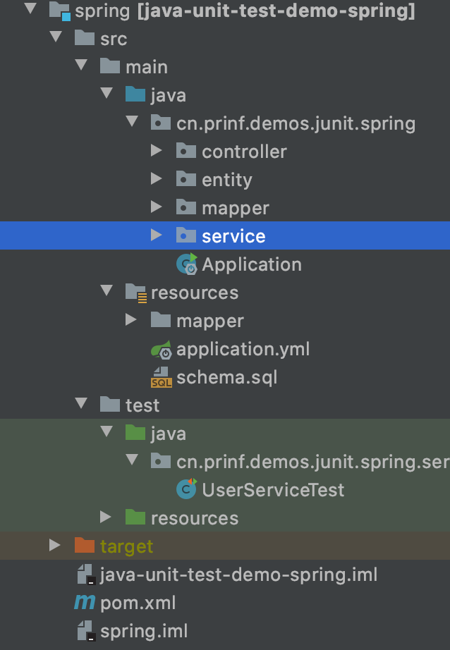
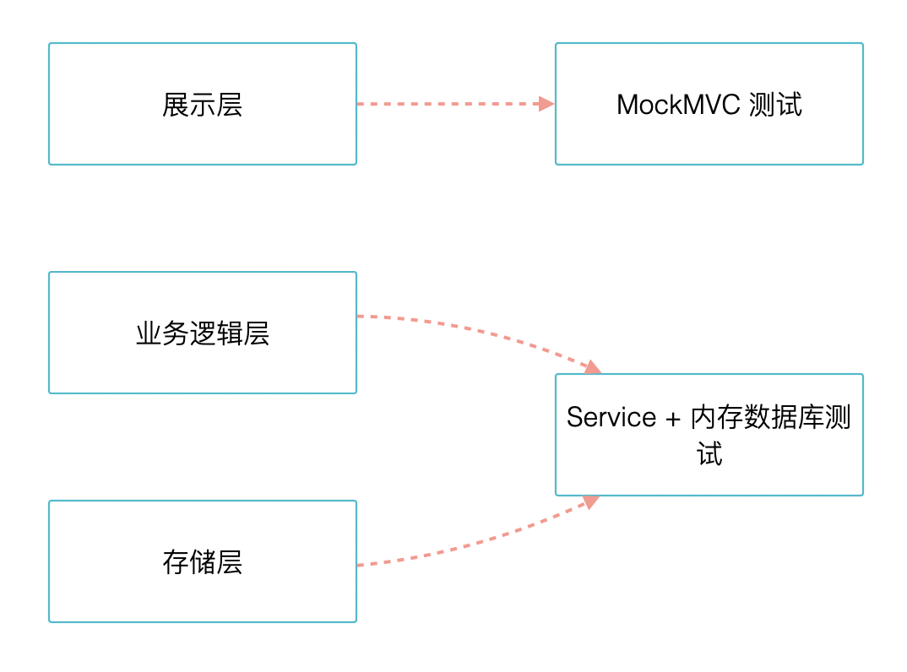
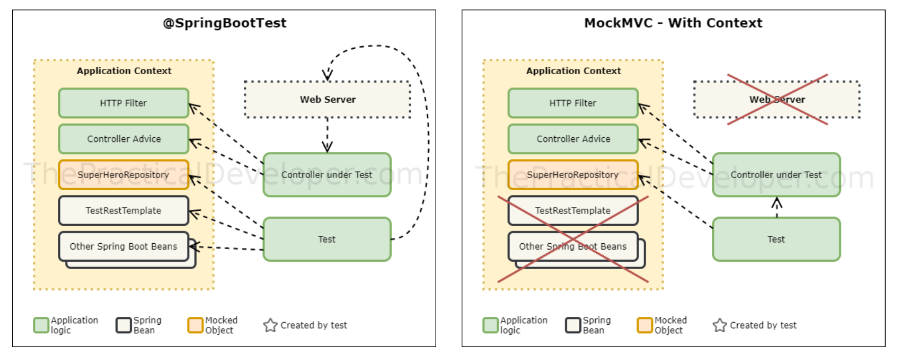

# Spring Boot 测试实践


Java 开发中目前最流行的技术栈就是 Spring Boot 了，大部分讲解单元测试或者 TDD 的书籍围绕 Spring Boot 的讲解比较少，但是 Spring Boot 测试相关的内容比较多，也比较实用。这部分就是围绕 Spring、Spring Boot 来编写单元测试。

这部分的代码位于： https://github.com/linksgo2011/java-unit-testing-book/tree/master/spring

我当前使用的 Spring Boot 版本是 2.1.7.RELEASE，在 2.1.x 系列版本中，Spring Boot 还是使用的 Junit 4，在后期的版本的中，会升级到 5。JUnit 5 带来了全新的架构，会有一些不同，为了简单暂时使用 JUnit4。

## 理解 Spring Boot 测试体系

在 Spring Boot 编写单元测试的时候，有时候会觉得概念比较混乱难以理解，在网上找一些代码贴上来不知道就怎么工作了，出现问题也不知道怎么修。

在 Spring Boot 项目中做测试，我们会用到很多包，这些包处于不同的层次以及提供不同的功能：

- [JUnit 4](https://junit.org/): JUnit 和前面提供到的一样，作为单元测试工具已经成为了 Java 单元测试事实上的标准。
- [Spring Test](https://docs.spring.io/spring/docs/5.1.9.RELEASE/spring-framework-reference/testing.html#integration-testing) & Spring Boot Test: Spring 和 Spring Boot 框架中提供的一些工具，用于启动 IOC 容器和 Servlet 容器。
- [AssertJ](https://joel-costigliola.github.io/assertj/): 流式断言库。
- [Hamcrest](https://github.com/hamcrest/JavaHamcrest): JUnit 内置依赖的断言库。
- [Mockito](https://mockito.github.io/): Mock 工具，用于模拟对象。
- [JSONassert](https://github.com/skyscreamer/JSONassert): 用于断言  JSON 节点，做 API 测试的时候用的比较多。
- [JsonPath](https://github.com/jayway/JsonPath): 可以通过 XPath 语法访问 JSON。

在实际项目中，可以由几种测试类型：

1. 只使用 JUnit4 就可以测试的简单对象、静态方法类
2. 如果是纳入 IOC 容器管理的 Bean 对象，需要使用 Spring Test 的 Runner + Mockito 隔离被测试的对象，这个时候需要启动 Spring 上下文，但是容器中只放了必要的被测试对象。
3. 依赖非常复杂，Mock 成本很高，或者直接想测试和 Servlet 结合很紧密的代码。例如想要测试 Controller 是否能真正反馈需要的响应，可以使用 Spring Boot Test 这个框架启动一个模拟的 Spring Boot 上下文。不过这个阶段接近于集成测试，Spring Boot 文档中也将这部分内容分为集成测试。


无论这三种类型如何使用，我们都可以使用 Spring Boot Test Starter 引入需要的测试框架，然后按需取用即可。这三种测试类型，测试的粒度由低到高，同时测试运行的时间也由低到高。

我们需要尽可能的选用低成本测试方法，降低测试运行时间的同时也能减少样板代码。


Spring Boot Test Starter 基本上引入了所需要的所有测试功能，可以直接使用。

```java
<dependency>
    <groupId>org.springframework.boot</groupId>
    <artifactId>spring-boot-starter-test</artifactId>
    <scope>test</scope>
</dependency>
```

## 只启动 Spring IOC 容器的测试

示例代码是一个典型的 Spring Boot 后端系统，有 Controller、Service 等分层。




UserService 中的主要逻辑是添加用户、列出用户等功能，UserService 依赖 UserMapper。如果只是测试 UserService 然后 Mock 掉依赖的 Mapper 其实非常容易。

我们创建一个测试并使用 SpringRunner，作为测试的 Runner，配合 Mockito 创建基本的测试环境：

```java 
@RunWith(SpringRunner.class)
public class UserServiceTest {

    @InjectMocks
    private UserService userService;

    @Mock
    private UserMapper userMapper;
    ...
}
```

我们添加另个测试，用来测试列出、添加用户两个功能：

```java
 @Test
    public void should_list_users() {
        userService.listAll();
        Mockito.verify(userMapper).selectAll();
    }

    @Test
    public void should_add_user() {
        User user = new User() {{
            setUsername("zhangsan");
            setPassword("123456");
        }};

        userService.add(user);

        ArgumentCaptor<User> argument = ArgumentCaptor.forClass(User.class);
        Mockito.verify(userMapper).insert(argument.capture());

        assertEquals("zhangsan", argument.getValue().getUsername());
        assertEquals("667f1213e4a57dbee7cd9e8993b82adef1032f7681a5d5c941c30281f90e7eceba629cc9ccf3f133fb478f3f54d9537c2dd50895380f659370c2a14147449ac4", argument.getValue().getPassword());
        assertNotNull(argument.getValue().getCreateAt());
        assertNotNull(argument.getValue().getUpdateAt());
    }
```

这样一个基本的测试就可以了，在大多数的情况下，使用 SpringRuner + Mockito 能完成大部分的工作。

@RunWith(SpringRunner.class) 最有用的一个特性当然一个 Service 依赖的对象非常多，并且有一部分被依赖的对象是经过验证可靠地，为了减少 Mock 对象的数量，完全可以将这些对象引入进来。

使用 SpringRunner 后即可使用 @Autowired 来加载其他的 Bean 了。

## Spring Boot 全量测试自动配置

使用 SpringRunner 后即可使用 @Autowired 来加载其他的对象，这是 Spring Test 框架提供的能力。我们知道 Spring Boot 的作用是自动化的配置，通过配置文件帮我们默认定义了大量的 Bean。如果启动 Spring Boot 上下文就可以使用 Spring Boot 完整的能力进行测试，需要 Mock 东西就更少了。


@SpringBootTest 帮我们启动 Spring MVC 的 Mapping、初始化数据库连接、日志等一系列配置。

利用这个特性，我们可以 UserServiceTest 不 Mock 掉 UserMapper，并使用 H2 内存数据库进行更真实的测试。

```java
@RunWith(SpringRunner.class)
@SpringBootTest
public class UserServiceTest {

    @Autowired
    private UserService userService;

    @Test
    public void should_list_users() {
        userService.listAll();
    }

    @Test
    public void should_add_user() {
        User user = new User() {{
            setUsername("zhangsan");
            setPassword("123456");
        }};

        userService.add(user);
    }
}
```

userService 是这个上下文中真实的对象，依赖的 UserMapper 也会通过 @SpringBootTest 帮我们创建，从而访问数据库。上面的例子只是验证能否工作，还没有断言，我们可以增加一些测试数据，并断言。

Spring Test 框架提供了一个简单但是常用的类 JdbcTestUtils，该类可以使用一个 JdbcTemplate 统计和操作数据库表。我们执行添加用户的操作，可以统计数据库用户表记录行数。

```java
@Autowired
private JdbcTemplate jdbcTemplate;

@Test
public void should_add_user() {
    User user = new User() {{
        setUsername("zhangsan");
        setPassword("123456");
    }};

    userService.add(user);
    int count = JdbcTestUtils.countRowsInTable(jdbcTemplate, "user");
    assertEquals(1, count);
}
```

正因为@SpringBootTest 帮我们启动了必要的配置，因此使用了 @SpringBootTest 就意味者变成了一个集成测试，大大的拖慢速度。在实际工作中，我们可以按需启用，需要测试 Mybatis mapper 时，可以使用 @MybatisTest 只加载必要的配置。

## Spring Boot 局部测试自动配置

如果需要使用 SpringBoot 帮助自动配置上下文，需要在测试目录下创建资源目录，并配置相应的 yaml 或者 property 文件。

有一些项目使用在业务目录中创建一个 application-test.yml，并通过 Profile 指定为 test 来创建测试阶段的配置。这种做法在 E2E 测试中用的较多，在单元测试阶段不建议这样使用。

@SpringBootTest 会默认启动应用所有的自动配置，例如：

- Web 服务器，例如 Tomcat 
- 数据库连接池
- Myabtis 或者、JPA 的相关配置

通常来说这样的配置系统对我们单元测试来说太重了，这会拖慢我们的测试的运行速度。换句话说，如果我只想要测试 Controller 其实没必要启动 web 服务器（使用 MockMvc ，Tomcat 运行非常华）；测试 Repository 或者 Mapper 也只需要配置相关的 Bean 即可。

spring-boot-test-autoconfigure 模块提供了很多 @…Test 代替 @SpringBootTest 来提供局部的自动化配置。@...Test 会启动应用上下文，并引入有限的@AutoConfigure…。

例如 @WebMvcTest 就只会启动 RequestMapping 相关的 Bean，支持  `@Controller`, `@ControllerAdvice`, `@JsonComponent`, `Converter`, `GenericConverter`, `Filter`, `WebMvcConfigurer` 和 `HandlerMethodArgumentResolver`  相关的 bean。

使用 @WebMvcTest 就可以只测试控制器，而不必启动其他相关的 Bean。

```java
@RunWith(SpringRunner.class)
@WebMvcTest(UserVehicleController.class)
public class MyControllerTests {

	@Autowired
	private MockMvc mvc;

	@MockBean
	private UserVehicleService userVehicleService;

	@Test
	public void testExample() throws Exception {
		given(this.userVehicleService.getVehicleDetails("sboot"))
				.willReturn(new VehicleDetails("Honda", "Civic"));
		this.mvc.perform(get("/sboot/vehicle").accept(MediaType.TEXT_PLAIN))
				.andExpect(status().isOk()).andExpect(content().string("Honda Civic"));
	}

}
```

几个常用的测试自动配置注解：

- @DataJdbcTest 数据源相关配置
- @DataJpaTest JPA 相关配置
- @DataRedisTest  Redis 相关自动配置
- @WebMvcTest Mvc 相关自动配置

需要注意的是，Mybatis 不在默认的自动配置中，需要引入相关的 Starter 才能使用。@...Test 不能组合使用，如果想要在 @WebMvcTest 时候配置其他 Bean，可以通过 @AutoConfigure… 注解选择性的引入自动配置即可，。或者直接使用 @SpringBootTest 全量自动配置。


## 分层测试和测试策略

Spring Boot 项目一般会分为 Controller、Service、Repository 三层，在编写单元测试时，需要考虑分层隔离测试。

如果我们每层都编写单元测试，会出现大量无意义的样板代码。如果不分层测试，为了达到相同而效果需要编写的用例组合就越多，因此我们需要考虑好分层测试的策略问题。

Repository 实际上由 JPA 或者 Mybatis 这类框架完成，实际上可以不需测试。值得测试的是 Controller 和 Service 层。如果代码耦合足够低，大量的业务逻辑在 Service 层，而非 Controller 层，所以我们常常将测试的焦点锁定在 Service 层。

另外一种声音是单元测试应该严格遵守分层测试原则，JPA 的 Repository 或者 Mybatis 的 Mapper 应该被单独测试否则测试不够单元。这种说法无可厚非，但是现实中 Repository 和 Mapper 的通用性很难做的很高，且大量代码都是和 Service 绑定的。所以对 Spring Boot 的测试策略建议如下：

- Controller 层测试。使用 MockMVC 测试控制器相关逻辑是否正确，包括输出格式、头部和异常等。Controller 层测试不要直接 new Controller 对象，这样测试不到大量的注解，也不启动真正的 WebServer，而是使用 MockMVC 代替。
- Service 层 + 持久层。使用 @JapDataTest 或者 @MybatisTest 自动配置数据库连接，数据库使用 H2 等内存数据库。对于测试数据而言，不直接创建数据库中的数据，而是使用上游方法操作数据。比如测试用户列出方法，应该先确保用户添加方法没有问题，然后使用用户添加方法创建数据库中的用户，这样可以减少成本。



在 MVC 项目中编写两种单元测试就够了，我们先来看下对控制器的 MockMVC 测试。

### MockMVC 测试

如果我们只关注 Controller 的测试，MockMVC 是非常好的选择。使用起来非常简单，只需要使用下面两个注解即可：

```java
@RunWith(SpringRunner.class)
@WebMvcTest(UserController.class)
```

@WebMvcTest 启动相应的 Bean 并把 UserController 加入模拟的 RequestMapping。MockMVC 测试过程中不会发起真实的 Http 请求，因此我们需要注入一个 MockMvc 对象来构造请求。

同时，@WebMvcTest 不会启动整个应用上下文，UserController 依赖的 Service 没有初始化，因此需要使用 @MockBean  来进行 Mock，否则会报 Bean 找不到的错误。得到 Mock 对象后，可以用 Mokito 内部的 given 等静态方法进行操作，定义返回值等。

最后，我们需要使用 MockMvc 的实例构建请求、发送请求并验证返回值。

完整的 例子如下：

```java
@RunWith(SpringRunner.class)
@WebMvcTest(UserController.class)
public class UserControllerTest {

    @Autowired
    private MockMvc mvc;

    @MockBean
    private UserService userService;

    @Test
    public void should_list_users() throws Exception {
        given(userService.listAll()).willReturn(
                Arrays.asList(new User() {{
                    setId(01L);
                    setUsername("Test user");
                    setPassword("123456");
                    setCreateAt(Instant.now());
                    setUpdateAt(Instant.now());
                }})
        );

        this.mvc.perform(get("/users").accept(MediaType.APPLICATION_JSON))
                .andExpect(status().isOk());
    }
}
```


#### 对 Bean 的 Mock 和 Spy


Mock 和 Spy 相关注解的使用和 Runner 密切相关，在 SpringBoot 的项目中，想使用 Spring Test 提供的相关工具，一般我们都是用 SpringRunner。对象之间的依赖是通过 Bean 完成的，而不是简单的赋值。所以在 SpringRunner 中需要使用 @MockBean 而不是 @Mock。

@MockBean 注解内部依然是创建的 Mokito 的 Mock 对象，不过是以 Bean 的方式存在，并以此初始话 ApplicationContext 上下文。@MockBean 被用于任何的测试类中的属性中，也可以被用于 @Configuration 修饰的类的属性上，用来准备测试配置。另外需要注意的是，SpringRunner 提供的 ApplicationContext 上下文会被缓存，从而节省测试的时间。使用 @MockBean 创建的对象会自动在测试完成后被重置，如果是自己创建的对象，需要注意是否会造成测试过程中的内存泄露。

同样的如果一个 Bean 已经被其他配置定义了，可以直接使用 @SpyBean 对这个 Bean 进行包装和监视，达到完成测试的目的。


#### MockMVC 使用详解

@SpringBootTest 和 @WebMvcTest（MockMVC） 的区别非常容易让人迷惑，造成混用。



从上面的图可以看出，MockMVC 的测试更加轻量和简单，但是必要时需要手动 Mock 或者配置一些依赖的 Bean。

should_list_users 测试方法中主要有两部分，一个是对 Mock 的对象给予返回值。另外一个就是发出请求和验证请求。

```java
this.mvc.perform(get("/users").accept(MediaType.APPLICATION_JSON))
                .andExpect(status().isOk());
```

这部分的链式调用容易让人迷惑，现在来拆解一下，完成这个过程比较长，相对啰嗦。

```java
// 1. 构建一个模拟请求，get 方法接受一个请求的路径，并设置 accept 头部值为 application-json
MockHttpServletRequestBuilder builder = MockMvcRequestBuilders
        .get("/users")
        .accept(MediaType.APPLICATION_JSON);
// 2. 执行这个请求，生成一个 ResultAction
ResultActions perform = this.mvc.perform(builder);
// 3. 定义一个匹配器
ResultMatcher okMatcher = MockMvcResultMatchers.status().isOk();
// 4. 执行这个匹配器进行断言
perform.andExpect(okMatcher);
```

MockHttpServletRequestBuilder 可以创建出 GET、POST、PUT、DELETE 等请求，如果需要在 URL 上带参数可以使用重载方法 get(String urlTemplate, Object... uriVars)。使用 POST 可以通过 content() 方法设置请求的 body 参数，还可以通过 multipart 来设置文件参数，用于测试文件上传功能。

执行构造出来的请求，获得一个 ResultActions 并用于后面的断言，确认测试结果。

执行完成后，断言前使用 ResultMatcher 构造一个匹配器，除了匹配状态外，还可以匹配返回头部、内容。如果是 json 返回内容，还可以使用 jsonpath 来断言 json 数据结构。


值得一提的是，多次请求之间还可以通过 cookie 的方式传递认证信息，在必要时能用得上。


### Service 测试


## 内嵌数据库	

## 内嵌 Redis

## 鉴权处理


## 测试工具集

